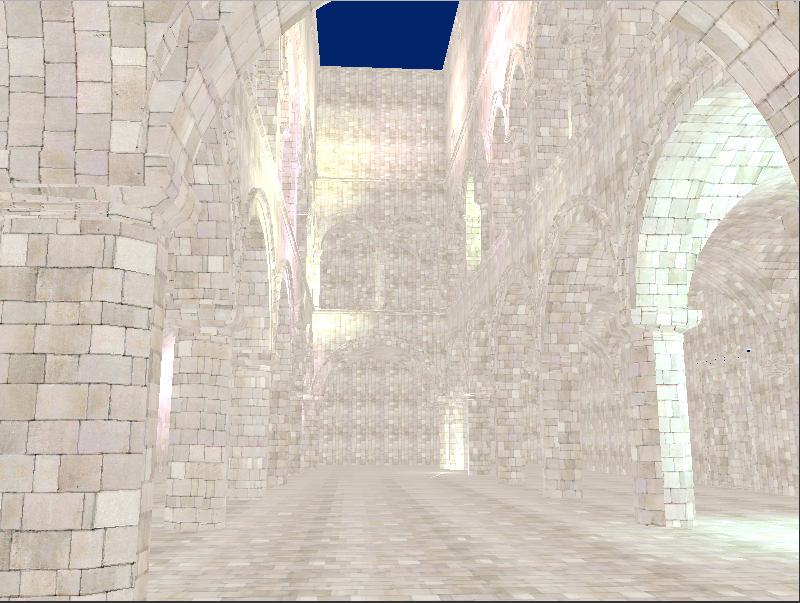
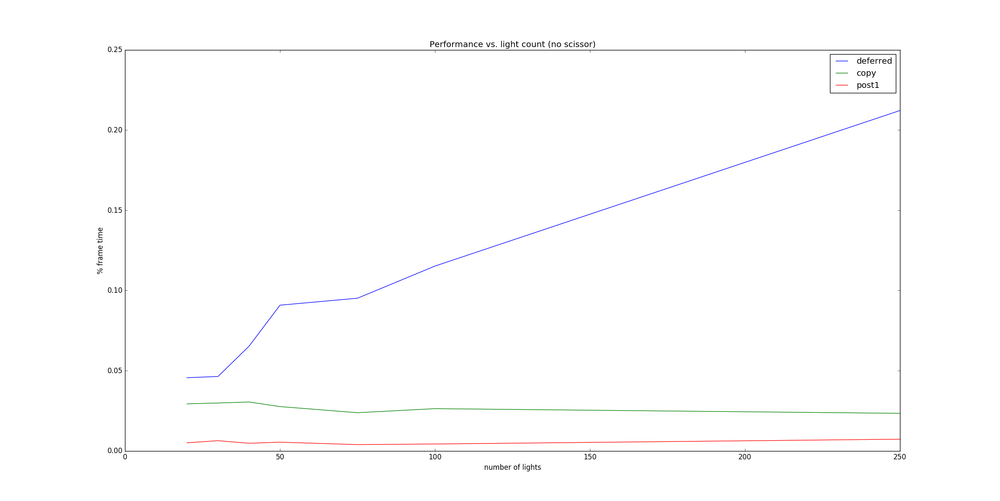
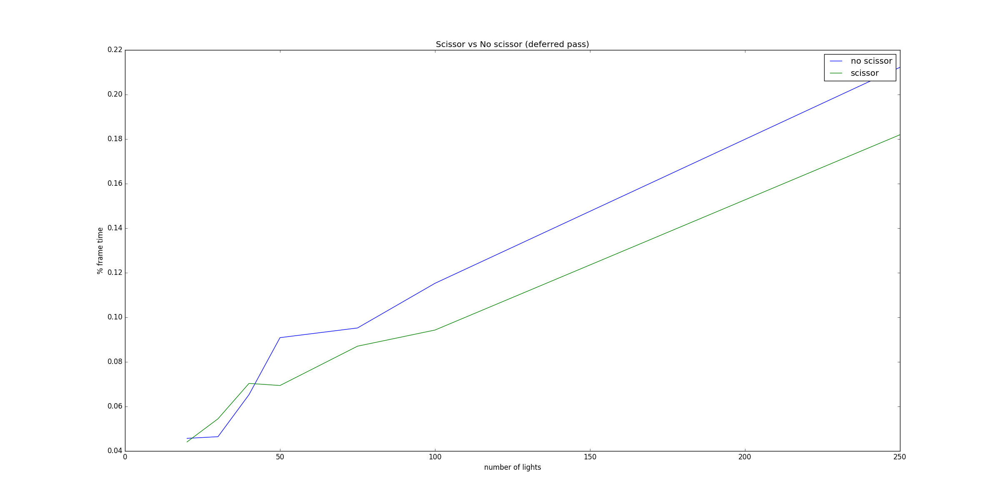
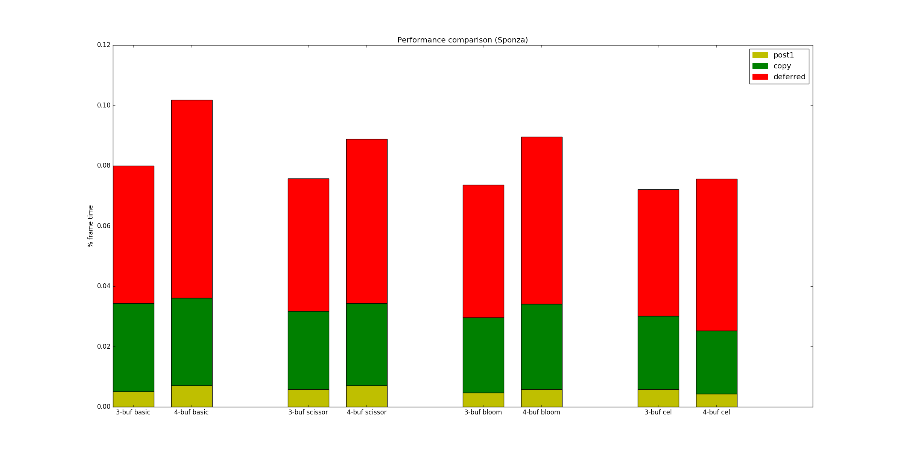
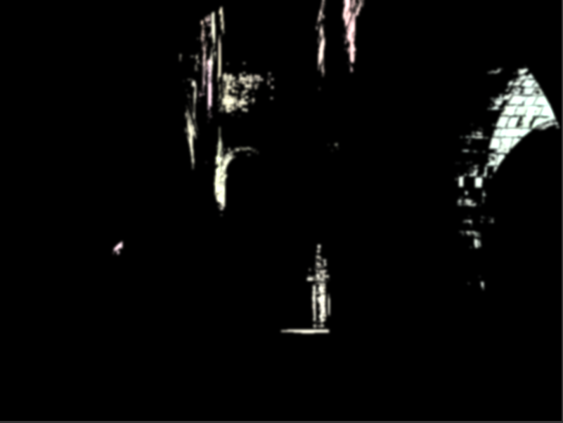
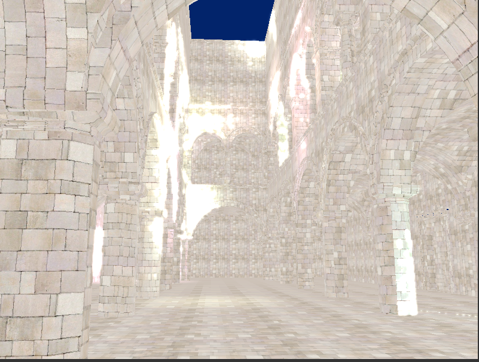
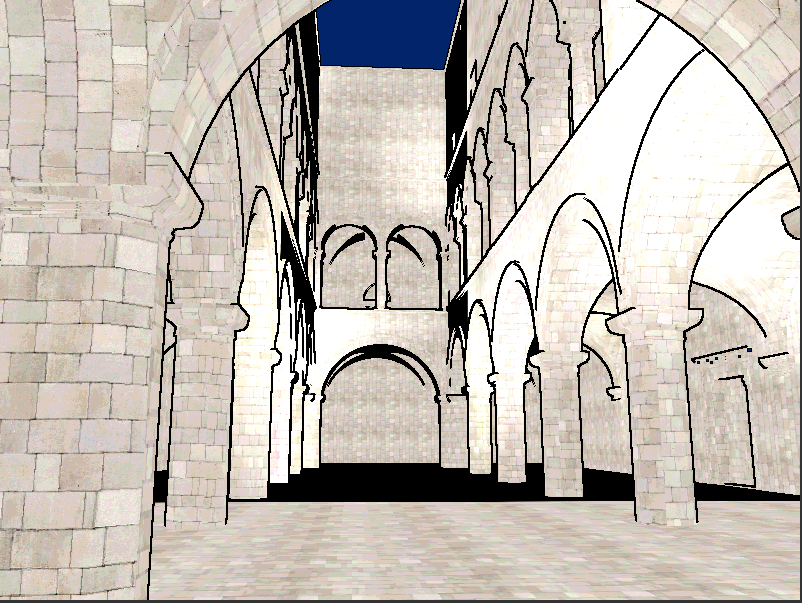

WebGL Deferred Shading
======================

**University of Pennsylvania, CIS 565: GPU Programming and Architecture, Project 5**

* Daniel Krupka
* Tested on: Debian testing (stretch), Intel(R) Core(TM) i7-4710HQ CPU @ 2.50GHz 8GB, GTX 850M

# About
This is a WebGL deferred renderer, featuring
* GLTF model loading
* Scissor optimization
* G-Buffer optimization
* Bloom lighting, with single or two-pass Gaussian blur
* Cel shading

# Screenshots

# Base Performance
## Lights and Scissor Optimization
As expected, increasing the number of lights degrades the performance of the deferred lighting pass.
This graph shows the percentage of each frame's processing time that was spent on each pass. The number
of lights ranged from 20 to 250.

The other passes (G-Buffer copying, framebuffer moving) were unaffected - they operate only on pixels,
independent of object count.

Rendering only the region of the framebuffer affected by each light theoretically and practically improve
the lighting performance, though not by much.

This can likely be improved by calculating more accurate bounding boxes for each light, as well as by adding
other culling, like removal of lights behind all objects.

## G-Buffer Optimization

To further improve performance, I consolidated two of the provided G-Buffers (geometry normals and the normal map).
Theoretically, this should boost the copy pass. However this also turned out to provide even more benefit to the lighting
pass. Likely, this is because computation of the combined normal and binding/sampling of the G-Buffer textures are practically
more expensive than the memory transfer of a single buffer.

Further improvement could be achieved by using a) the fact that normals are normalized to compute them from only two components, and
b) that world-space coordinates can be computed from screen-space x,y, to eliminate the position G-Buffer and use only a two-float normal buffer.
However, this will likely incur a cost of having to reconstruct the missing components.

# Effects
## Bloom

I implemented Bloom by extracting 'bright' portions (according to standard sRGB luminance values) of the deferred-pass output,
then performing a Gaussian blur and adding it to the rendered output. A togglable option switches between single-pass and two-pass blur,
though the latter seemed to actually cause worse performance. This is likely an implementation flaw, due to switching framebuffers and rebinding textures.

Bloom did not seem to affect overall performance.

## Cel-shading
I also implemented cel-shading, by creating a simple 1D stepped ramp texture, which was sampled in order to 'posterize' each RGB channel.
Contouring is done with a seperate shader, which simply tests for large depth changes and subtracts from those (smoothed) locations.

