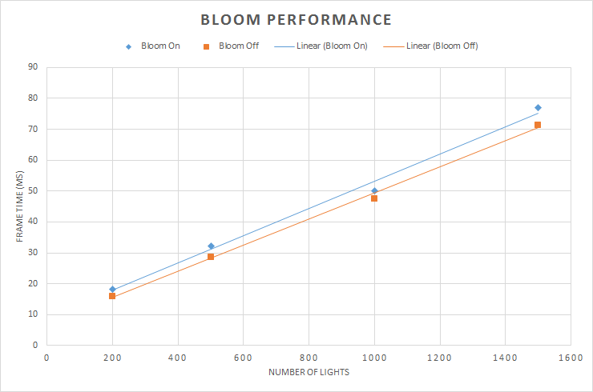
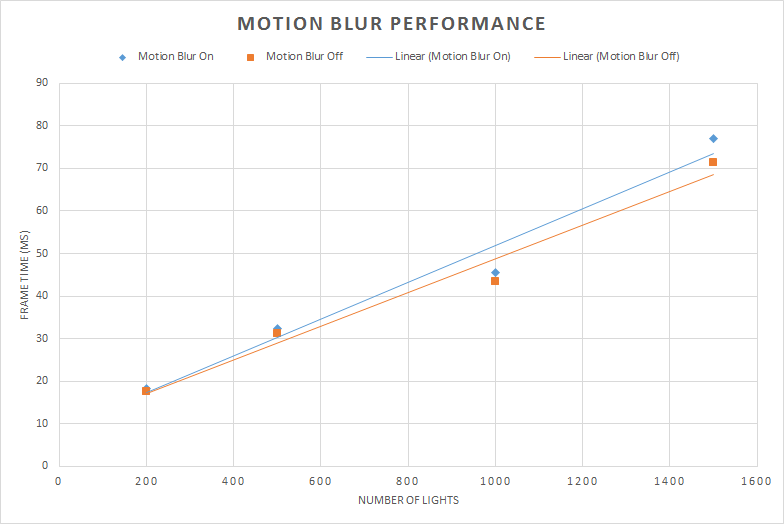
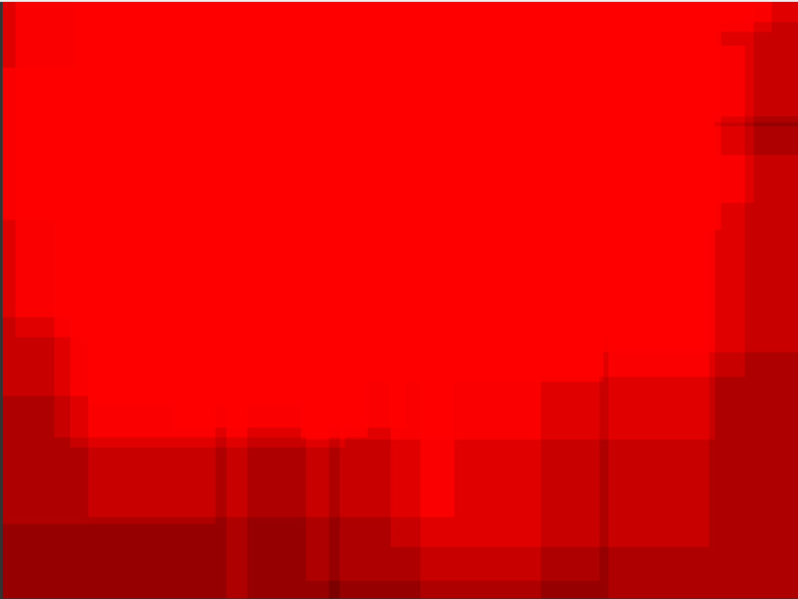
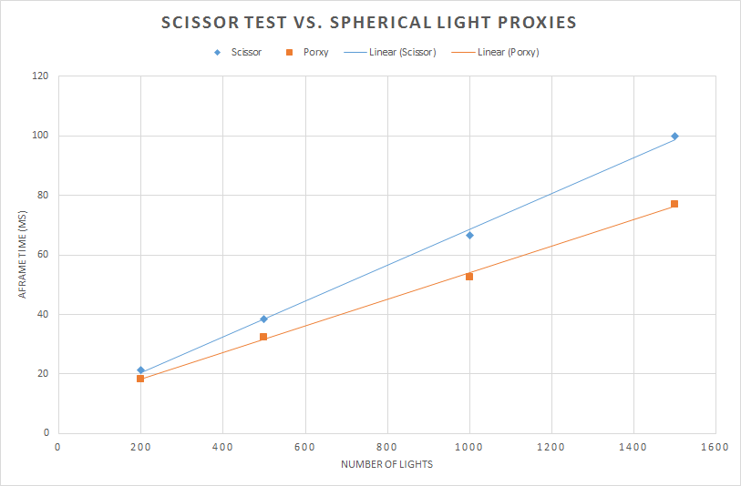

WebGL Deferred Shading
======================

**University of Pennsylvania, CIS 565: GPU Programming and Architecture, Project 5**

* Jian Ru
* Tested on: **Google Chrome 54.0.2840.71 m (64-bit)**
  Windows 10, i7-4850 @ 2.3GHz 16GB, GT 750M 2GB (Personal)

### Live Online

### Demo Video/GIF

### Analysis

* Features
  * Basic deferred shading pipeline
  * Bloom with 2-pass Gaussian filtering
  * SS Motion Blur
  * G-buffer optimization
  * Spherical light proxies

* Bloom
  * Extracting bright regions
    * Convert RGB color to illuminance using `I = 0.2126 * R + 0.7152 * G + 0.0722 * B` and copy the pixels whose brightness pass a user defined threshold.
  * Blur the resulting brightness map
    * I used two 1D Gaussian kernels with size 1x9 and 9x1 respectively and convolve them with the brightness map 5 times each.
  
  

* SS Motion Blur
  * Implemented by following the idea from GPU Gems 3, Ch. 27.
  * Reconstruct point world position using pixel texture coordinates and depth
  * Transform the point from world to the NDC space in the previous frame by pre-multiplying it with the inverse of view-projection matrix from last frame
  * Velocity vector is defined as the difference between the point's positions in the current and last frame
  
  
  
* G-Buffer Optimization
  * G-buffer number reduced to 1 from 4 by
    * Applying normal map in the copy pass instead of the light pass
    * Using only two-component normal by taking advantage of the fact that normals have lengths of 1
    * Reconstructing eye space position from screen coordinates and depth of pixels
    * Can easily reduce further to 1 by packing albedo with normal but choose not to for the sake of performance because bit shift and bit-wise operations are not available in GLSL 1.0. Doing packing hence requires many floating point divisions and multiplications.
    * Further testing shows that using only 1 G-buffer gives better performance. I think the reason is that enabling multiple rendering targets and the extra global memory writes have greater cost than the extra floating point computations.
    
    | G-buffers | R | G | B | A |
    | --- | --- | --- | --- | --- |
    | G-buffer 1 | nrm.x | nrm.y | unused | unused |
    | G-buffer 2 | albedo.r | albedo.g | albedo.b | unused |
  
  
  
* Spherical Light Proxies
  * Render spheres instead of a full screen quad with scissor test to trigger light computation
  * Each sphere is move to center at each point light source and scaled to the light's radius of influence
  * The benefits is increased accuracy of light influence estimation, which further reduce the chance of shading unlit pixels. As a result, it further improves performance.
  
  | Scissors | Spherical Proxies |
  | --- | --- |
  |  |  |
  
  

### Credits

* [Three.js](https://github.com/mrdoob/three.js) by [@mrdoob](https://github.com/mrdoob) and contributors
* [stats.js](https://github.com/mrdoob/stats.js) by [@mrdoob](https://github.com/mrdoob) and contributors
* [webgl-debug](https://github.com/KhronosGroup/WebGLDeveloperTools) by Khronos Group Inc.
* [glMatrix](https://github.com/toji/gl-matrix) by [@toji](https://github.com/toji) and contributors
* [minimal-gltf-loader](https://github.com/shrekshao/minimal-gltf-loader) by [@shrekshao](https://github.com/shrekshao)
