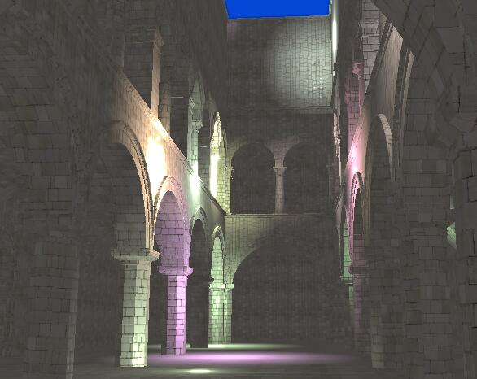
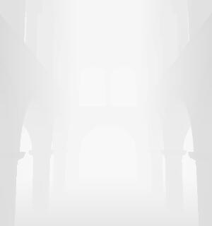
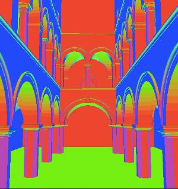
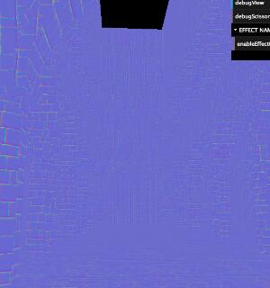
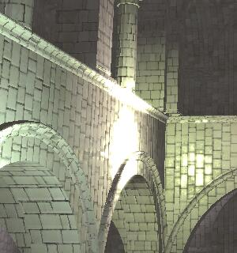
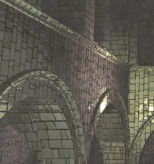
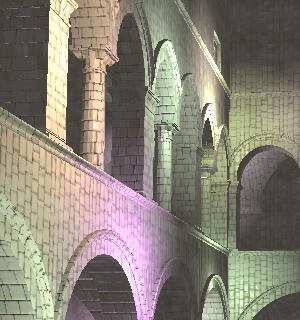
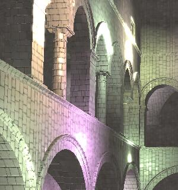
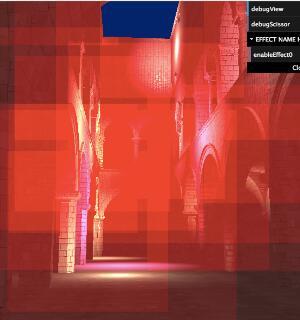
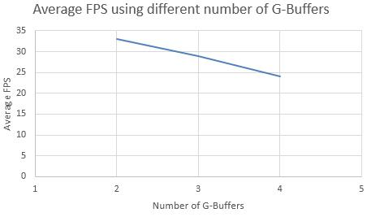

WebGL Deferred Shading
======================

**University of Pennsylvania, CIS 565: GPU Programming and Architecture, Project 5**

* Kaixiang Miao
* Tested on: Windows 7, i7-3630QM @ 2.40GHz 8GB, GTX 660M 2GB (Lenovo Y580 laptop, personal computer)

### Live Online

### Demo Video/GIF

### Features

* Blinn-Phong shading model
* Optimized lights rendering by scissor test
* Optimized by using less G-Buffers (reduce from 4 to 2)
* Toon shading (ramp shading && edge detection)
* Bloom effect (Gaussian blur && ping-pong frame buffers)
* Screen space motion blur

### G-Buffers
<table class="image">
<tr>
	<td>depth buffer</td>
	<td>geometry normal</td>
	<td>normal (tangent space)</td>
</tr>
<tr>
	<td></td>
	<td></td>
	<td></td>
</tr>
</table>

### Effects
<table class="image">
<tr>
	<td>non-toon shading</td>
	<td>toon shading</td>
</tr>
<tr>
	<td></td>
	<td></td>
</tr>
</table>

<table class="image">
<tr>
	<td>no bloom</td>
	<td>bloom</td>
</tr>
<tr>
	<td></td>
	<td></td>
</tr>
</table>

<table class="image">
<tr>
	<td>motion blur</td>
</tr>
<tr>
	<td></td>
</tr>
</table>

#### Scissor Test
<table class="image">
<tr>
	<td>Scissor Area</td>
</tr>
<tr>
	<td></td>
</tr>
</table>

### Analysis

* Using less G-Buffers
	* calculate the world-space normal in the copy stage
	* convert the screen-space point to world-space point using the depth value in the depth buffer and the camera transformation matrix

FPS is increased:
	

* Scissor Test

While rendering the point-light effect, it's unnecessary to render all screen since point lights have their own radius. The part which is outside of the circle of the point lights can be cut.

Scissor Test increases the FPS significantly.

Without scissor test, the average FPS is **13**.

If only discarding the lights whose scissor is off the screen, the average FPS is increased to **16**.

If we perform scissor test to cut the parts which are out of the rectangular, the average FPS is **24**.

* Toon shading

Implemented with ramp shading and edge detection.

Reference: [Toon shading](http://www.lighthouse3d.com/tutorials/glsl-12-tutorial/toon-shading-version-i/)

* Bloom effect

Bloom gives noticeable visual cues about the brightness of objects as bloom tends to give the illusion objects are really bright. When done in a subtle fashion (which some games drastically fail to do) bloom significantly boosts the lighting of the scene and allows for a large range of dramatic effects.

The idea is to extract the bright color and do a 2-pass Gaussian blur first, then merge the blurred image to the scene, which means we should use framebuffer to temporarily store the color.

Reference: [Advanced Lighting: Bloom](http://learnopengl.com/#!Advanced-Lighting/Bloom)

* Screen space motion blur

store the previous camera transformation matrix
	
Reference: [Motion Blur as a Post-Processing Effect](http://http.developer.nvidia.com/GPUGems3/gpugems3_ch27.html)
 
### Credits

* [Three.js](https://github.com/mrdoob/three.js) by [@mrdoob](https://github.com/mrdoob) and contributors
* [stats.js](https://github.com/mrdoob/stats.js) by [@mrdoob](https://github.com/mrdoob) and contributors
* [webgl-debug](https://github.com/KhronosGroup/WebGLDeveloperTools) by Khronos Group Inc.
* [glMatrix](https://github.com/toji/gl-matrix) by [@toji](https://github.com/toji) and contributors
* [minimal-gltf-loader](https://github.com/shrekshao/minimal-gltf-loader) by [@shrekshao](https://github.com/shrekshao)
