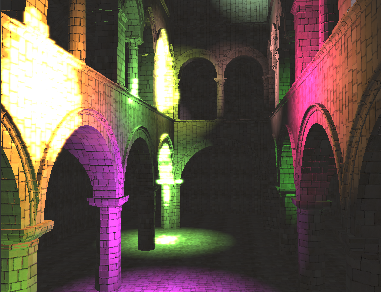
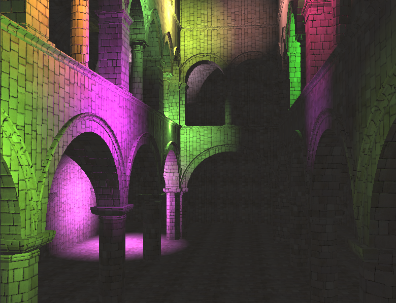

WebGL Deferred Shading
======================

**University of Pennsylvania, CIS 565: GPU Programming and Architecture, Project 5**

* Trung Le
* Tested on: **Google Chrome 54.0** on
  Windows 10 Home, i7-4790 CPU @ 3.60GHz 12GB, GTX 980 Ti (Personal desktop)

# Live Online

# Demo Video/GIF

# Features

| **Bloom ON ** | **Bloom OFF**|
|---|---|
||||

### 1. Bloom filter

### 2. Tiled shading

Data structure layout for the grid construction. This figure is taken from [Tiled Shading](http://www.cse.chalmers.se/~uffe/tiled_shading_preprint.pdf)

# Credit

- [Blinn-Phong](http://sunandblackcat.com/tipFullView.php?l=eng&topicid=30&topic=Phong-Lighting)
- [Bloom](http://learnopengl.com/#!Advanced-Lighting/Bloom)
- [Tiled Shading](http://www.cse.chalmers.se/~uffe/tiled_shading_preprint.pdf)