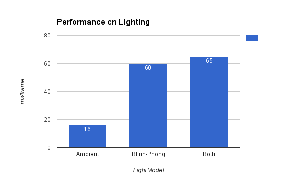

WebGL Deferred Shading
======================

**University of Pennsylvania, CIS 565: GPU Programming and Architecture, Project 5**

* Liang Peng
* Tested on: **54.0.2840.87 m (64-bit)** on
  Windows 10, i7-6700HQ @ 2.6GHz 8GB, GTX 960 (Personal Laptop)

[//]: # "### Live Online"

[//]: # ""

### Demo Video/GIF

### Features

* [x] Basic Pipeline
  * [x] Render to G-Buffer
  * [x] Deferred Shading
* [ ] Scissor Test
* [ ] Post Effect
* [ ] Performance Analysis

### Basic Pipeline

Depth | Position | Normal
--- | --- | ---
 |  | 

Color Map | Normal Map | Surface Normal
--- | --- | ---
 |  | 

Ambient Lighting | Blinn-Phong Lighting
--- | ---
 | 

### Performance Analysis

#### Lighting

Ambient | Blinn-Phong | Ambient + Blinn-Phong
:---:|:---:|:---:
16 ms/frame | 60 ms/frame | 65 ms/frame

_*Note_ Ambient lighting is present due to infinite light bouncing in the space, which finally lights every object in the scene evenly (from all angle). Blinn-Phong light consists of, in the simpliest case, two types of lighting, lambert diffuse and specular. Diffuse reflectance is proportional to _dot product of surface normal and light direction_, while specular reflectance is proportional to _dot prodect of surface normal and halfway direction raised to power of shininess_, where halfway direction is the bisectional direction of light direction and view direction.

#### Number of Lights

Num | 1 | 4 | 16 | 64 | 256 | 1024
:---:|:---:|:---:|:---:|:---:|:---:|:---:
ms/frame | 20 | 25 | 50 | 190 | 640 | -
FPS | 55 | 40 | 20 | 6 | 2 | -
_Note*_ Data above are measured __without scissor test__.

#### Scissor Test

Scissor Test OFF | Scissor Test ON
:---:|:---:

### Credits

* [Three.js](https://github.com/mrdoob/three.js) by [@mrdoob](https://github.com/mrdoob) and contributors
* [stats.js](https://github.com/mrdoob/stats.js) by [@mrdoob](https://github.com/mrdoob) and contributors
* [webgl-debug](https://github.com/KhronosGroup/WebGLDeveloperTools) by Khronos Group Inc.
* [glMatrix](https://github.com/toji/gl-matrix) by [@toji](https://github.com/toji) and contributors
* [minimal-gltf-loader](https://github.com/shrekshao/minimal-gltf-loader) by [@shrekshao](https://github.com/shrekshao)
