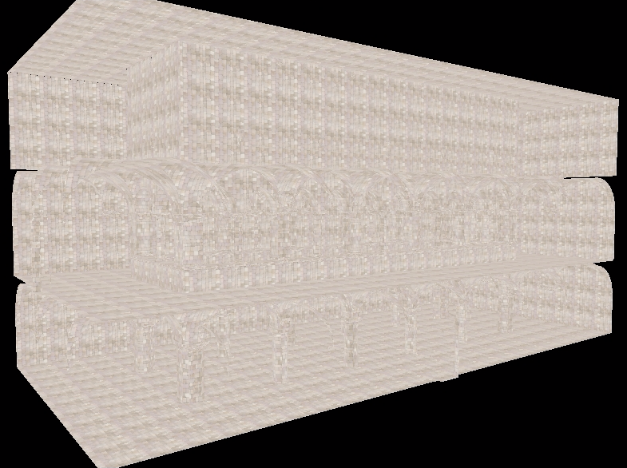
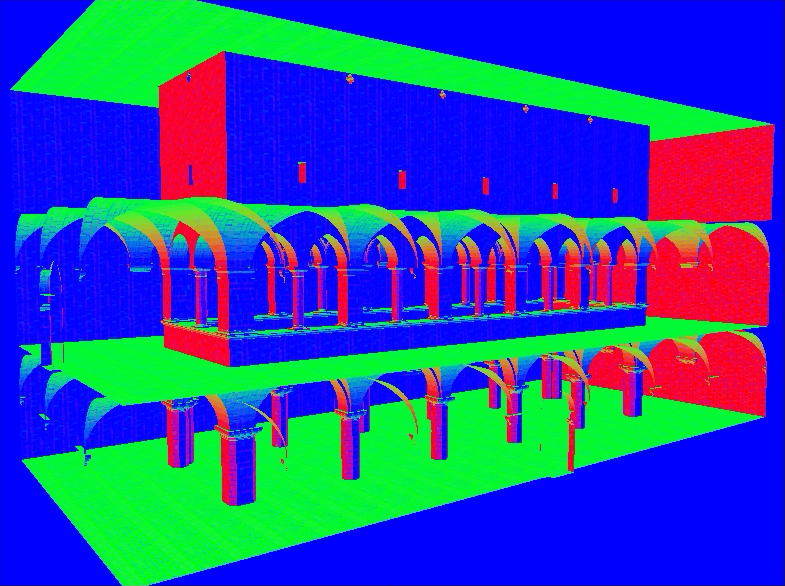
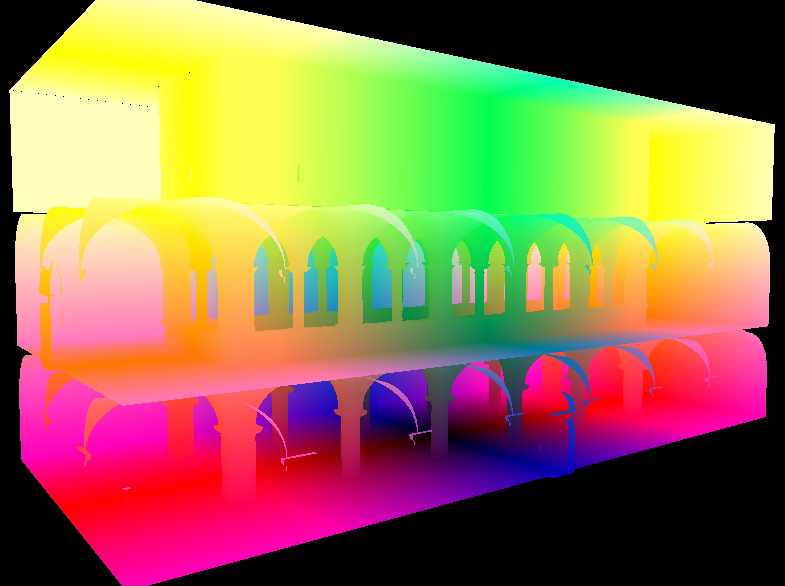
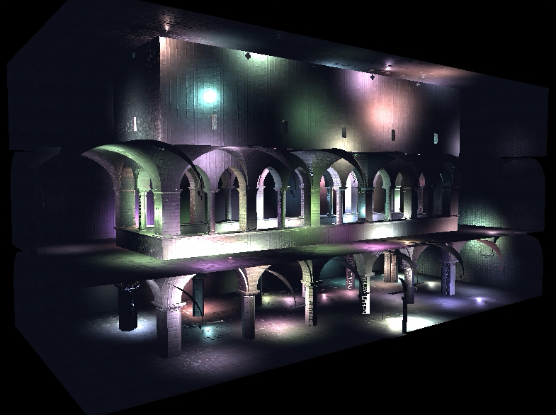
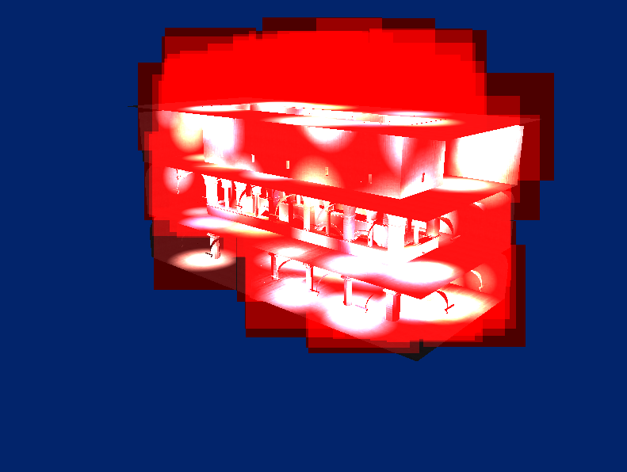
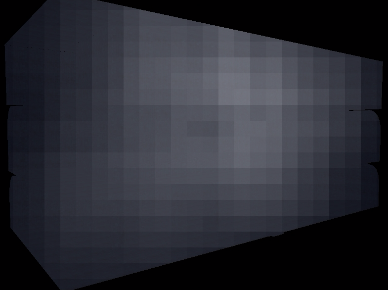

WebGL Deferred Shading
======================

**University of Pennsylvania, CIS 565: GPU Programming and Architecture, Project 5**

* Austini Eng
* Tested on: **Google Chrome 54.0.2840.59** on
  Linux Mint 18, i5-5200U @ 2.20GHz 7.7GB, GTX 940m

## [Live Demo]()

## Deferred Shading

In deferred shading, we pack geometry information into a `G-Buffer`. This allows separate between rasterization and lighting computation. Below, we have visualized separate colors, normals, positions, and depth attributes. Once these have been stored in a buffer, we can render the scene once for each light and add all the results together.

## Bloom

To compute bloom, we run a shader that just keeps the highlights, then blur that result in two directions, and then add it back to the original position.

Doing the blur in x and y separately is much more efficient. If we did the blur all at once, each thread running the fragment shader would need to look at 81 adjacent pixels. If we do them separately, each looks at just 9 pixels, twice. Each iteration stores the weighted average of the 9 influencing pixels based on [gaussian weights](http://dev.theomader.com/gaussian-kernel-calculator/).

Adding this effect is still pretty slow. Even a small amount of bloom adds about 30ms of time per frame.

## Scissor Optimization

We can optimize the naive implementation by only rendering the portion of the screen that overlaps a given light. Above is visualized the bounding boxes around the lights.

## G-Buffer Optimization

We can reduce memory overhead by optimizing the attributes stored in the G-Buffer. Less memory access should theoretically increase performance of our shaders. This was done in two ways. Instead of storing the geometery's surface normal and normal map separately, these were combined into just one attribute. Furthermore, only the x and y components were stored. We can compute the correct z component later.

We can also store just the rgb components of the color because the scene has no transparent objects. Decreasing the number of components stored, we can pack everything we need into just two buffers instead of the original four.

[X, Y, Z, NX], [R, G, B, NY]

## Tiled Rendering

If there are many lights in the scene, the naive implementation must make many redundant memory accesses. We render the scene once for every light, so if we have N lights, a fragment is rendered potentially N times. This is N separate fetches to access the memory stored in our G-Buffer. Performance would be signficantly better if we knew ahead of time which tiles influenced the fragment and computed the contribution of all of these in one pass.

Tiled deferred shading breaks the scene into tiles (here, I used 32x32) and computes the lights which could influence each tile before shading. Then, the fragment shader only needs to be run once to add up the contributions of all the lights. Below is a visualization of the number of lights affecting each tile.

Unfortunately, WebGL does not have compute shaders. To accomplish tiled deferred shading, I packed all the light attributes (position, color, radius) into two RGBAs: [X, Y, Z, r, R, G, B, _]. These were stored in a texture. Then a shader was run over a viewport of size (# tiles) x (# lights / 4). To create a mask denoting whether a light influenced a given tile. The size of the texture output by this shader was (# tiles) x (# lights / 4) because 4 flags were packed into each pixel. Each thread therefore computes 4 tile/light intersections.

The resulting texture is then bound and passed to the fragment shader. Each thread can now compute the index of the tile it its contained in, lookup exactly which lights it is influenced by, andd then perform all of the necessary lighting calculations.

## Performance Analysis

GBuffers | None | Scissor | Tiled
---------|------|---------|-------
4        | 120  |   90    | 28
3        |  -   |   64    | 28
2        |  -   |   40    | 27
*Time (ms) per frame with different optimizations and number of G-Buffers. Tests were done using 200 lights*

Adding tiled deferred shading significantly improved performance. Its impacts signficantly outweigh the performance gains earned by reducing the number of G-Buffers. This makes sense because optimizing the G-Buffer really only removes one or two memory accesses per pixel. On the other hand, tiled deferred shading allows us to decrease memory access by factor which scales with the number of lights. With 200 lights, this is an enormous improvement.

## Credits

* [Three.js](https://github.com/mrdoob/three.js) by [@mrdoob](https://github.com/mrdoob) and contributors
* [stats.js](https://github.com/mrdoob/stats.js) by [@mrdoob](https://github.com/mrdoob) and contributors
* [webgl-debug](https://github.com/KhronosGroup/WebGLDeveloperTools) by Khronos Group Inc.
* [glMatrix](https://github.com/toji/gl-matrix) by [@toji](https://github.com/toji) and contributors
* [minimal-gltf-loader](https://github.com/shrekshao/minimal-gltf-loader) by [@shrekshao](https://github.com/shrekshao)
