WebGL Deferred Shading
======================

**University of Pennsylvania, CIS 565: GPU Programming and Architecture, Project 5**

* Trung Le
* Tested on: **Google Chrome 54.0** on
  Windows 10 Home, i7-4790 CPU @ 3.60GHz 12GB, GTX 980 Ti (Personal desktop)

# Live Online

[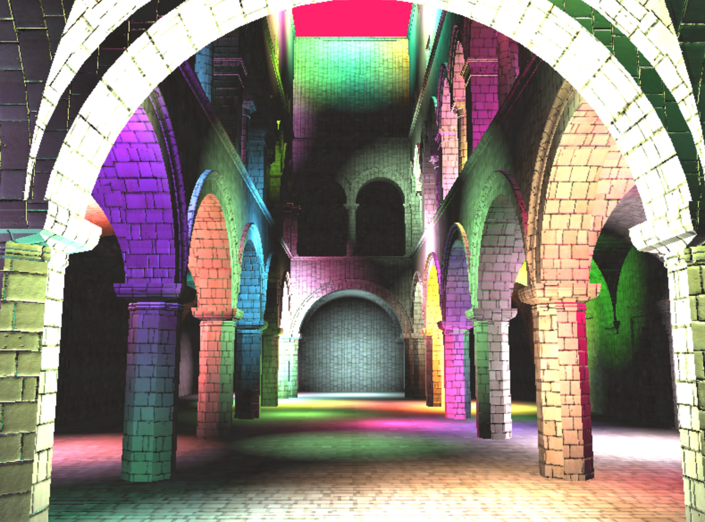](https://trungtle.github.io/Project5-WebGL-Deferred-Shading-with-glTF/)

# Demo Video/GIF

# Features

### 1. Effects

#### Bloom filter

| **Bloom ON** | **Bloom OFF**|
|---|---|
|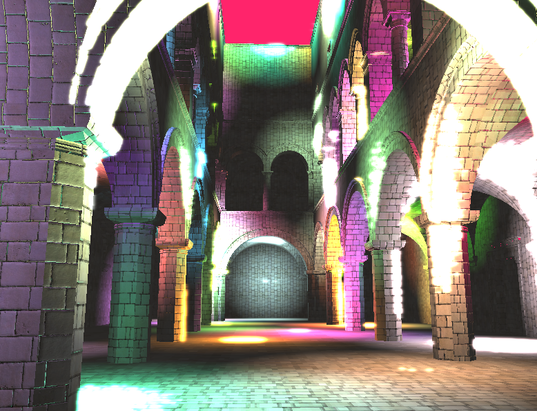|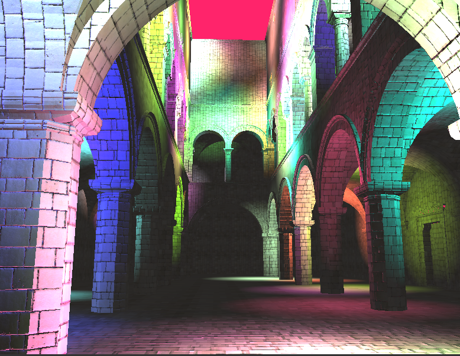|

_Bloom filter can be enabled under the "EFFECTS" tab of the control panel._

Bloom filter is a post processing effect. The following diagram is taken from [GPU Gems](http://http.developer.nvidia.com/GPUGems/gpugems_ch21.html) that explains the process:

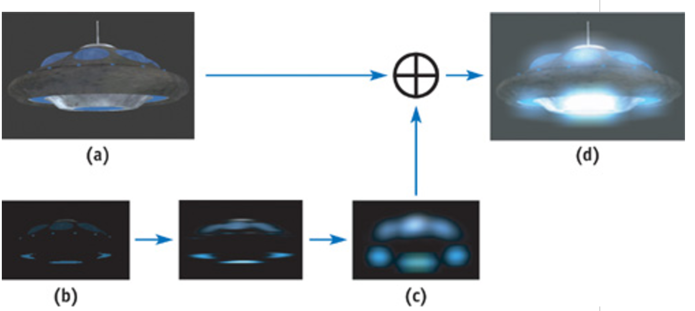

After the the light shading has been applied at the end of the deferred rendering, in addition to the regular color texture **(a)**, a brightness texture is also rendered **(b)**, based on the brightness of the light color. This brightness texture is then blurred twice using a Gaussian weight, first along the horizontal pixels, then along the vertical pixels.

In order to achieve the blurring along the vertical and horizontal dimension, two ping-pong framebuffers are used to toggle between each dimension. The bloom filter in the image above is blurred at five iterations.

The effect is adapted from [learnopengl](http://learnopengl.com/#!Advanced-Lighting/Bloom) and [GPU Gems - Chapter 21](http://http.developer.nvidia.com/GPUGems/gpugems_ch21.html) bloom filter tutorial.

#### Pixelate

| **Pixelate ON** | **Pixelate OFF**|
|---|---|
|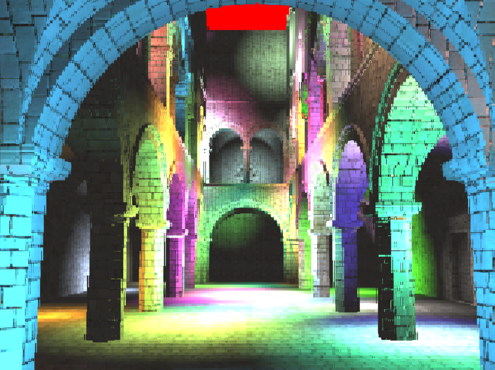||

_'Pixelate' effect can be enabled under the 'EFFECTS' tab of the control panel._

This is a post processing effect done in the fragment shader by manipulating the UV of the final image texture.

The effect is adapted from [OpenGL Tutorial - Chapter 14](http://www.opengl-tutorial.org/intermediate-tutorials/tutorial-14-render-to-texture/
).

### 2. Tiled shading

_Tiled shading can be enabled under the 'OPTIMIZATION' tab of the control panel. `debugTiledShading` colors each tile based on the number of overalapping light counts_

Tiled deferred shading is an approach to deferred shading that divides the screen into a grid of a typical size of 32x32 and then rearrange the shading loop. Traditionally, for deferred rendering, we shade the scene following the pattern:

```
// deferred pass

for each light
    for each fragment
        apply shading
```

This access pattern scales with the number of lights. The more lights there are in the scene, the number of times each fragment is computed increases.

With tiled deferred shading, we swap out the access pattern:

```
// deferred pass

for each tile
    for each light that overlaps tile
        apply shading
```

*** Pros ***

With this pattern, each fragment is only visited once (since each tile covers that portion of the screen once). As the number of lights on the screen increases, only the tiles that are affected by those lights take a hit on performace.

*** Cons ***

Tiling isn't always great. Since each fragment needs to process a list of different lights, branch divergence increases as more different types of light are used.

Another factor that affects tiled rendering is the light radius. With larger light radius, the same light data needs to be accessed more than once for different fragments.

Here is a comparison of tiled vs. no tiled deferred rendering based on the number of lights in the scene:


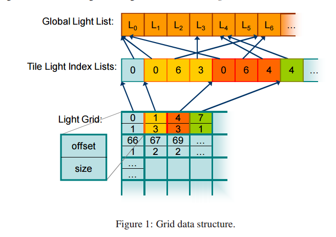

Data structure layout for the grid construction. This figure is taken from [Tiled Shading](http://www.cse.chalmers.se/~uffe/tiled_shading_preprint.pdf)

There are 4 textures constructed for the tile grid:

- _Light positions_: converted to an RGB float texture
- _Light colors_: converted to an RGB float texture
- _Light radius_: converted to an ALPHA float texture
- _List of light IDs_: converted to an ALPHA unsigned byte texture

For each tile rendered, the offset and light count into the list of light IDs texture for that tile is sent to the fragment shader as uniform objects.

The table below shows the rendering of each tile indepdently from each other (blended with ambient layer):

| Tile [0,1] | Tile [1,1] |
| --- | --- |
|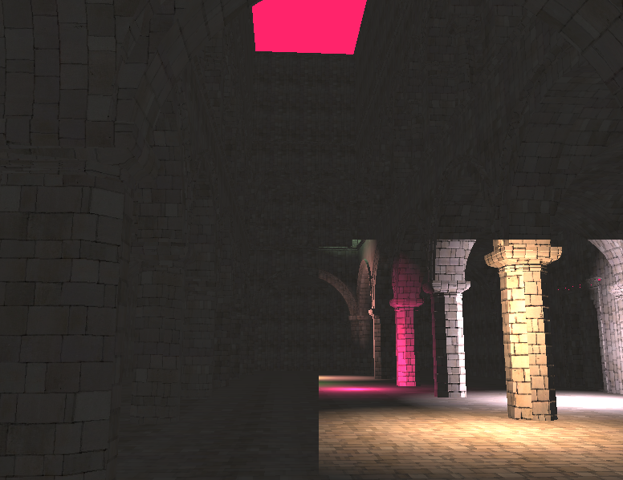|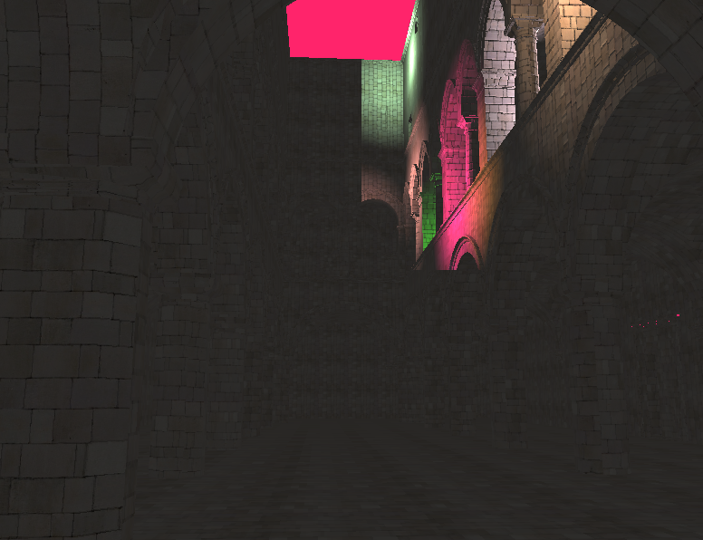|
| Tile [0,0] | Tile [1,0] |
| --- | --- |
|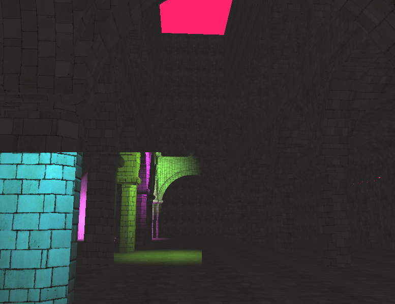|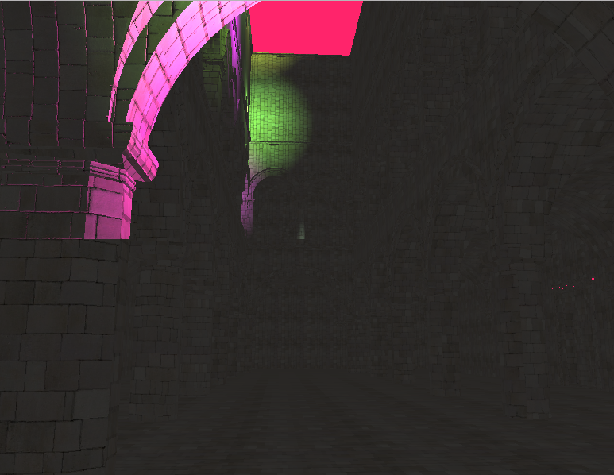|

_For the rest of this writing, I'm going to use a 32x32 grid in all demonstration, unless otherwise stated._ This grid size is known to have worked relatively well, althought there isn't an optimal grid size for all scenes.

Here, the tiles are colored based on the number of light count in that tile. Tiles that have more concentrated lights are brighter.

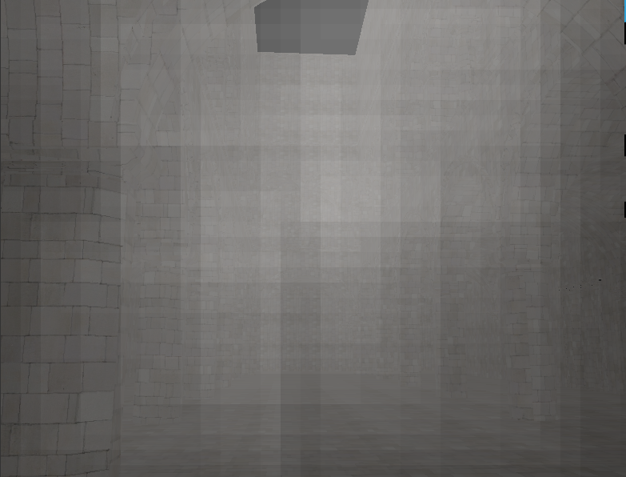

For a scene with a low number of lights, there isn't any inherent performance gain. But for scenes with a high number of lights, tiling greatly increases frame rate compared to tile-less.

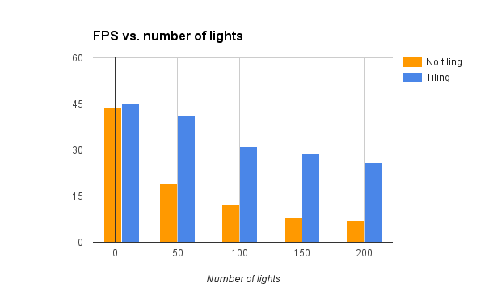

** Memory bandwidth **

The texture data transfer to the fragment shader is quite expensive, especially when invoking uniform and texture binding from OpenGL. If possible, the textures should be packed tightly to reduce memory bandwidth.

### Display all deferred layers

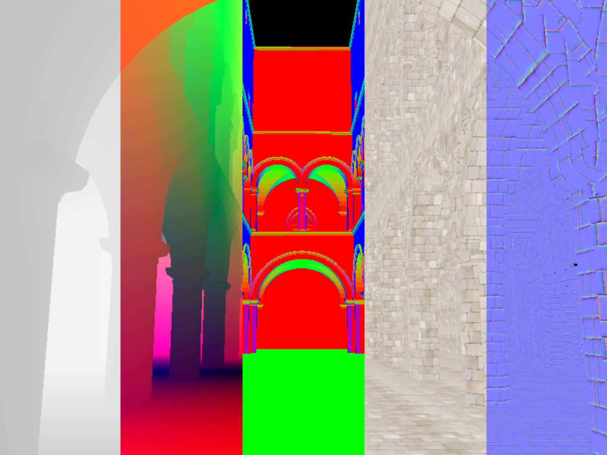

All deferred layers can be viewed by enabling 'showAllLayers' options under the control panel.

# Credit

- [Blinn-Phong](http://sunandblackcat.com/tipFullView.php?l=eng&topicid=30&topic=Phong-Lighting)
- [Bloom](http://learnopengl.com/#!Advanced-Lighting/Bloom)
- [Tiled Shading](http://www.cse.chalmers.se/~uffe/tiled_shading_preprint.pdf)
* [Three.js](https://github.com/mrdoob/three.js) by [@mrdoob](https://github.com/mrdoob) and contributors
* [stats.js](https://github.com/mrdoob/stats.js) by [@mrdoob](https://github.com/mrdoob) and contributors
* [webgl-debug](https://github.com/KhronosGroup/WebGLDeveloperTools) by Khronos Group Inc.
* [glMatrix](https://github.com/toji/gl-matrix) by [@toji](https://github.com/toji) and contributors
* [minimal-gltf-loader](https://github.com/shrekshao/minimal-gltf-loader) by [@shrekshao](https://github.com/shrekshao)
* [nearest power of 2](https://bocoup.com/weblog/find-the-closest-power-of-2-with-javascript)
* [packing data to texture](http://stackoverflow.com/questions/17262574/packing-vertex-data-into-a-webgl-texture)
