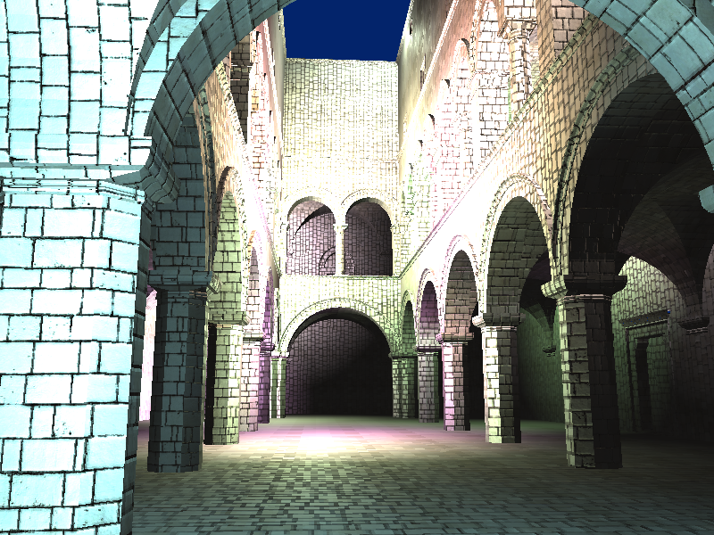
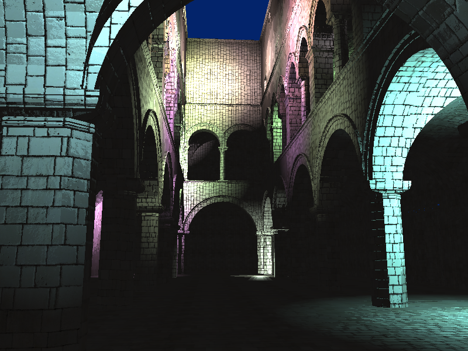
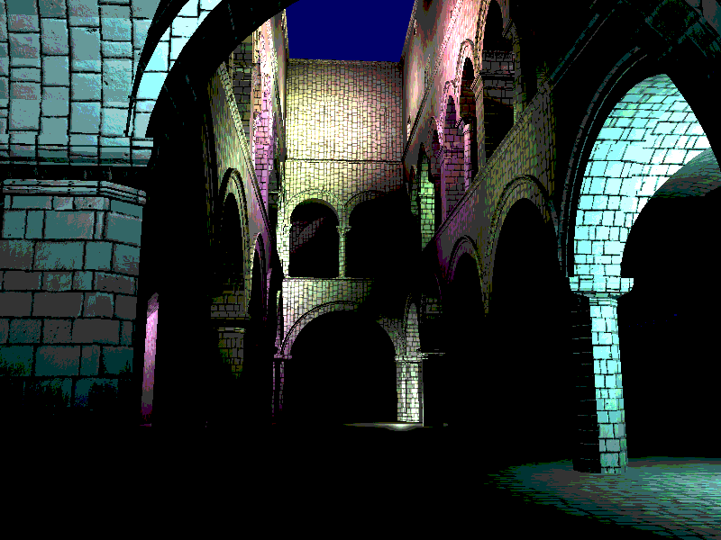
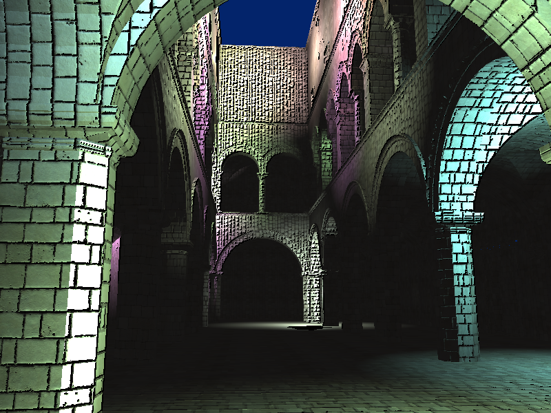
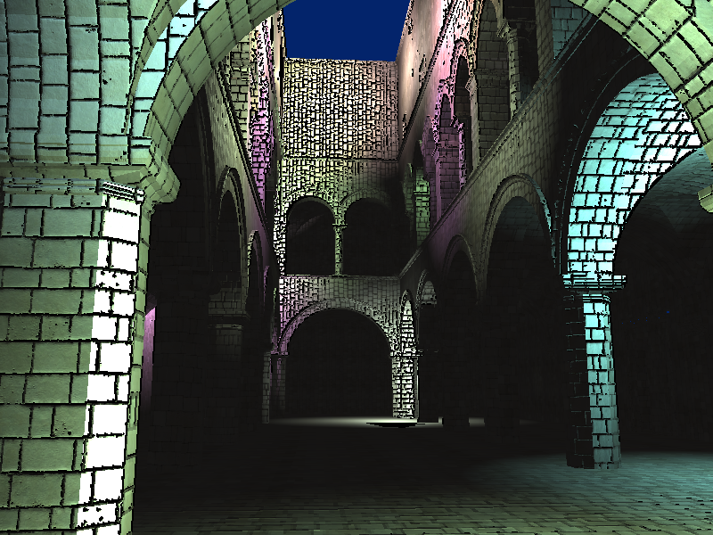
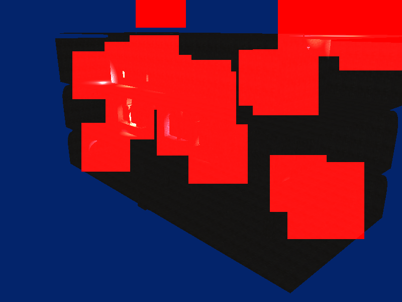
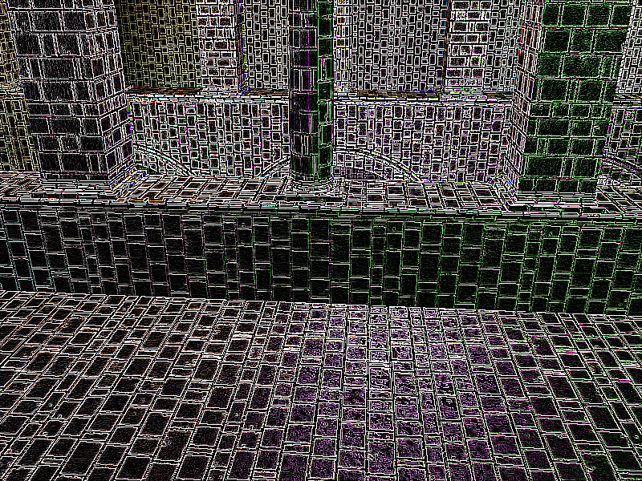

WebGL Deferred Shading
======================

**University of Pennsylvania, CIS 565: GPU Programming and Architecture, Project 5**

* David Liao
* Tested on: Google Chrome 54.0.2840.71 (64-bit) on
  Windows 10, i7-6700K @ 4.00GHz 16GB, Radeon R9 Nano 4096MB

### Live Online

[Try me live!](http://159.203.88.91/WebGL-Deferred-Shading)

### Demo Video/GIF

## Deferred Shading
In deferred shading, the lighting step is postponed to a later step. Instead, in the first pass through, all geometry data is accumulated into texture buffers known as G-buffers. This is then later on used in more complex lighting operations. The benefit of doing this is that all the fragments that are in the G-buffers will ultimately be used in a single lighting pass (the depth-test has already been applied to these fragments). This ensures that we dont run multiple lighting passes over objects that might never make it to a pixel.

## Shaders
### Default
The default lighting is simply a product of the attenuation and the color from the texture. The attenuation is the falloff of the light, which in our case is linear.

### Blinn-Phong
Blinn-phong is the standard baseline shader. https://www.wikiwand.com/en/Blinn%E2%80%93Phong_shading_model

### Ramp-Shading
Ramp shading is a non-photorealistic shader that "bands" together colors of similar value and rounds them to the nearest band. In the demo, you can tune the number of bands that are used. I did an experiment where I included ramp shading as a deferred shader and compared it to the post-processing version. Instead of banding the colors themselves, in this shader, I banded the lambertian and specular coefficients and then applied it to the colors. As a result, we have a more smoother transition between color bands. The main performance difference is negligible–the deferred shader computes the bands on the fly within that same shader.

## Post Process Effects

### Ramp-Shading (Post-process)
In this version of the Ramp-shading, we are directly looking at the final result of the fragments and band the color values independently through their components.

### Edge Highlights
Edge highlights are performed in two ways. One through a single-pass approximated sobel filter and one through a two-pass sobel filter. The latter method uses the standard horizontal and vertical sobel operators shown above. The latter combines the two as a component-wise sum. The rationale behind doing this combination is that the two passes are additively blended together and so we leverage the associativity and commutativity of the two sobel operators to combine them. This is not entirely accurate since the blending isn't necessarily factored in, but the end result looks nice and runs faster (by one shader load and execution). The single pass is on the left, and the two-pass is on the right.

 

### Depth of Field Blur
Similar to edge highlights, DoF is also applying a filter over the final fragments. There is a slider that adjusts the focus of the DoF.  Due to limitations of glsl/WebGL, I couldn't make the kernel size adjustable (no dynamic array allocation). The algorithm used to determine blurring rate is taking a focal value (which ranges from 0 to 1) and the depth value and using a quadratic falloff value as a standard deviation for a gaussian kernel. The reason we use a falloff value raised to a power is to widen the depth range that is within focus. We also needed to scale the value to have it map to reasonable standard deviation values.

## Optimizations
### Scissor Test
The scissor test is an optimization that discards fragments that fall outside of a rectangular region. This acceleration leverages light attenuation to allow for early termination when performing shading per light. Any region outside of the scissor rectangle doesn't need any light processing.

### G-Buffer Packing
The baseline implementation uses 4 buffers for positions, normals, color maps, and normal maps. We can precompute the normals by applying the normal map in the copy pass. This way the memory bandwith is much less throughout the pipeline. 

## Kernel Experiments
Here were some odd images that I got by using 3x3 kernels without thresholding–you need to threshold the value obtained from the convolution in order to get the highlighted edges. 

| -1 | -1 | -1 |
|----|----|----|
| -1 | 8  | -1 |
| -1 | -1 | -1 |

### Credits

* [Three.js](https://github.com/mrdoob/three.js) by [@mrdoob](https://github.com/mrdoob) and contributors
* [stats.js](https://github.com/mrdoob/stats.js) by [@mrdoob](https://github.com/mrdoob) and contributors
* [webgl-debug](https://github.com/KhronosGroup/WebGLDeveloperTools) by Khronos Group Inc.
* [glMatrix](https://github.com/toji/gl-matrix) by [@toji](https://github.com/toji) and contributors
* [minimal-gltf-loader](https://github.com/shrekshao/minimal-gltf-loader) by [@shrekshao](https://github.com/shrekshao)
