WebGL Deferred Shading
======================

**University of Pennsylvania, CIS 565: GPU Programming and Architecture, Project 4** 

* Xiang Deng
* Tested on:  Windows 10-Home, i7-6700U @ 2.6GHz 16GB, GTX 1060 6GB (Personal Computer)

 

With toon |  No toon 
:-------------------------:|:-------------------------:  
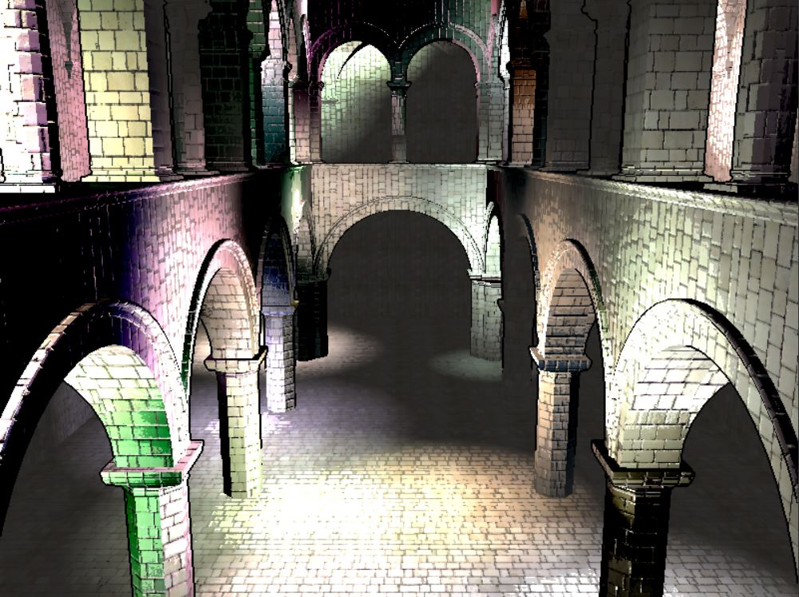 | 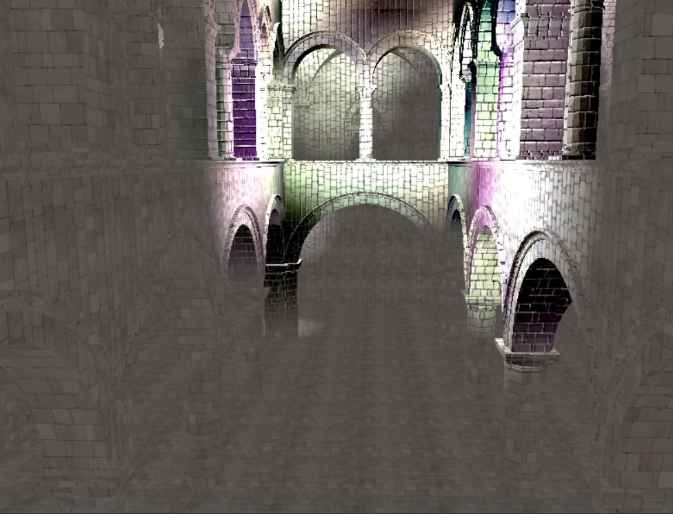 

With toon |  No toon 
:-------------------------:|:-------------------------:  
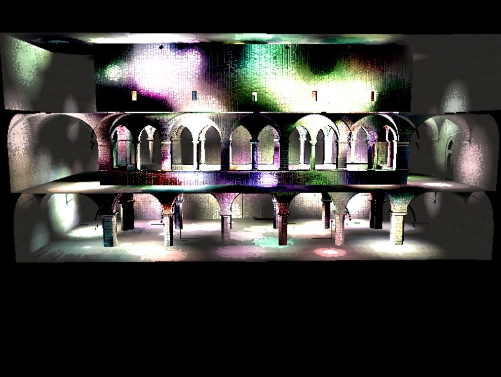 | 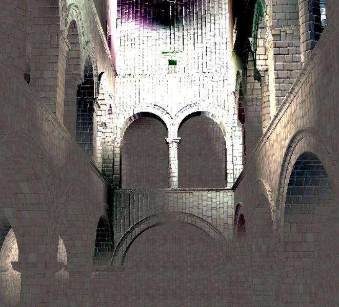 

With Bloom |  With Bloom&lava
:-------------------------:|:-------------------------:  
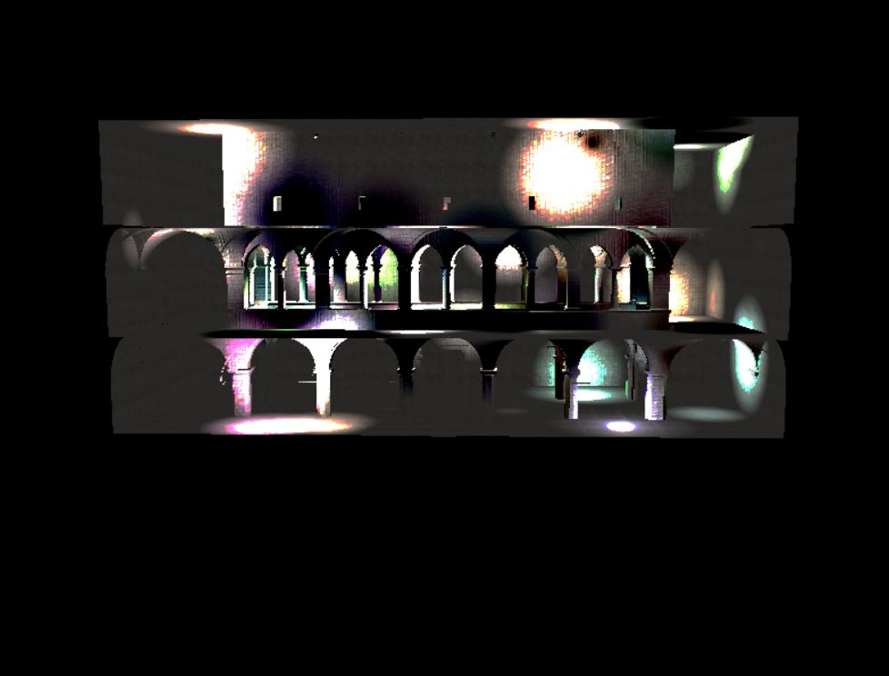 | 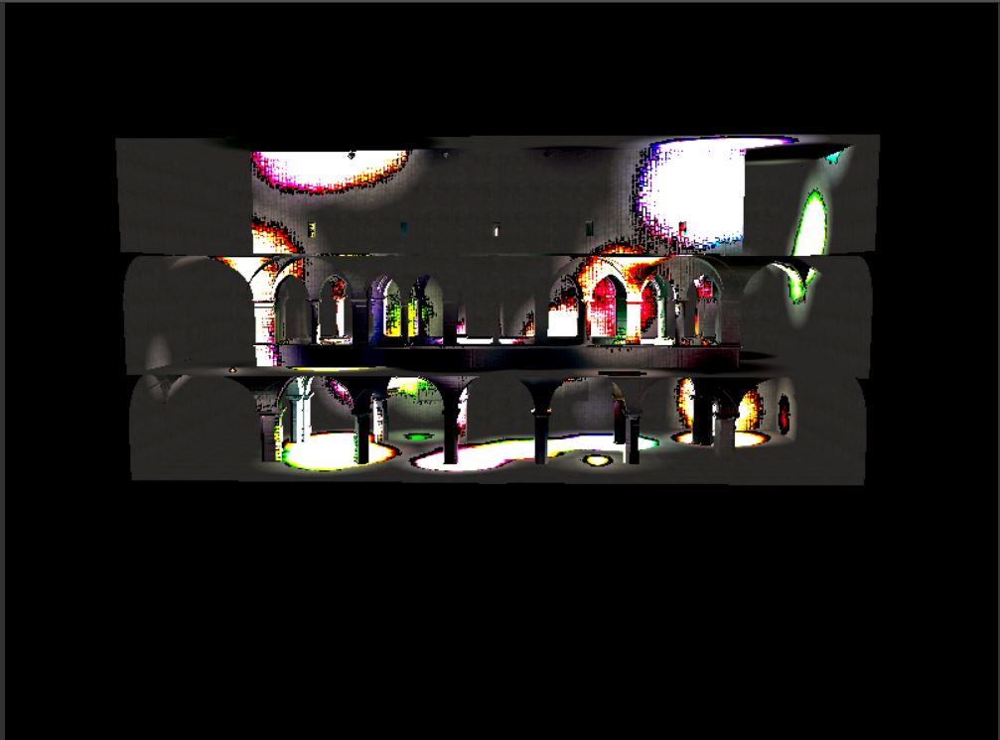 

With Scissor Debug |  With Sphere Debug
:-------------------------:|:-------------------------:  
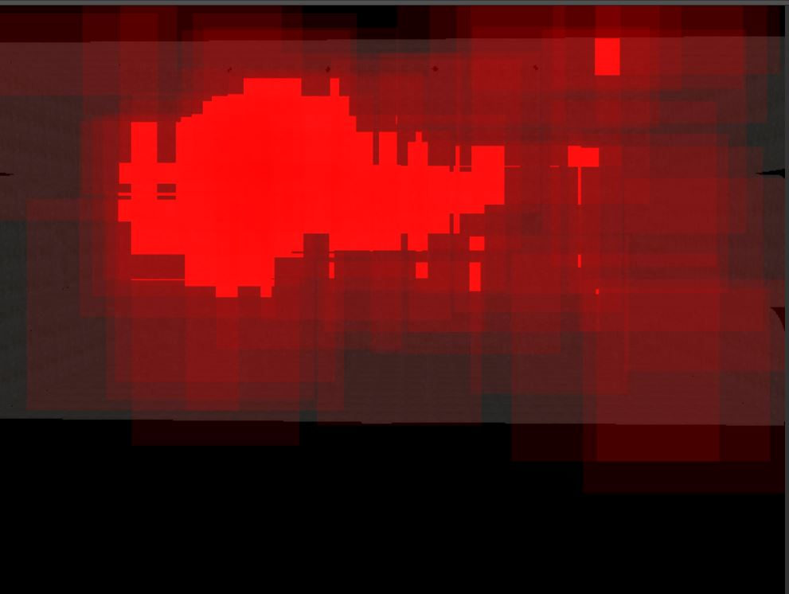 | 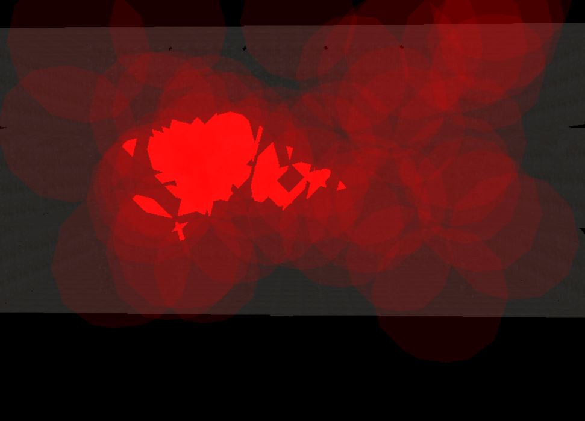 

 

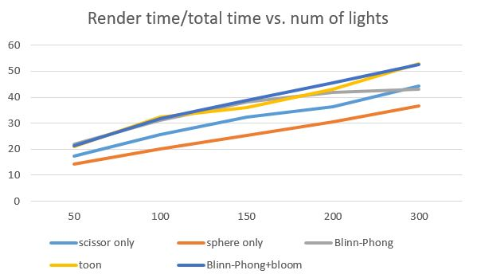 | 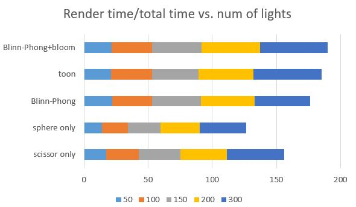 | 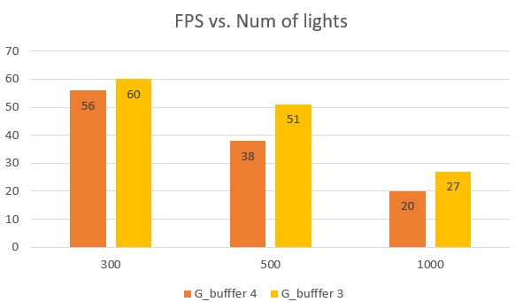

### Live Online

[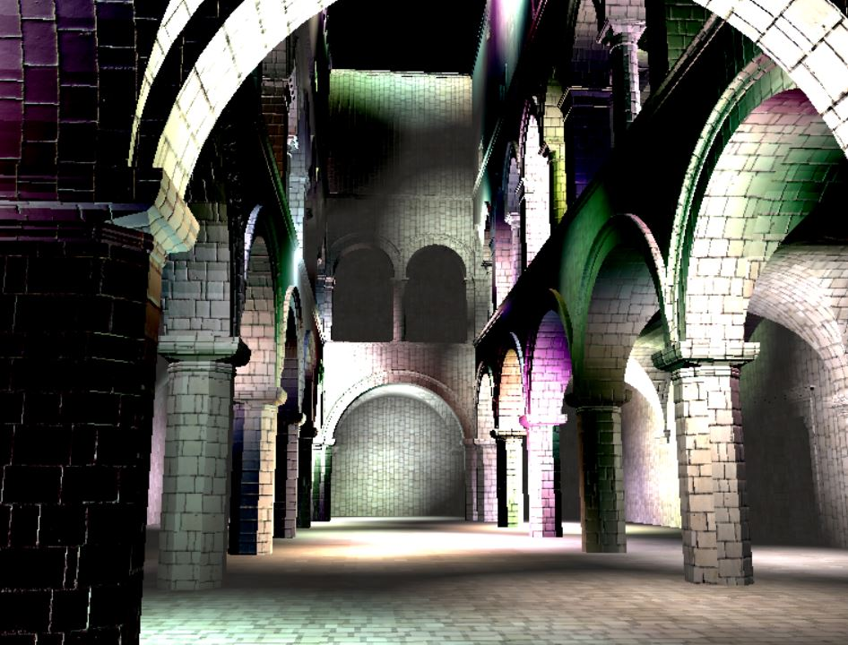](https://dengxianga.github.io/Project5-WebGL-Deferred-Shading-with-glTF)

### Demo Video/GIF

### (TODO: Your README)

*DO NOT* leave the README to the last minute! It is a crucial part of the
project, and we will not be able to grade you without a good README.

This assignment has a considerable amount of performance analysis compared
to implementation work. Complete the implementation early to leave time!

### Credits

* [Three.js](https://github.com/mrdoob/three.js) by [@mrdoob](https://github.com/mrdoob) and contributors
* [stats.js](https://github.com/mrdoob/stats.js) by [@mrdoob](https://github.com/mrdoob) and contributors
* [webgl-debug](https://github.com/KhronosGroup/WebGLDeveloperTools) by Khronos Group Inc.
* [glMatrix](https://github.com/toji/gl-matrix) by [@toji](https://github.com/toji) and contributors
* [minimal-gltf-loader](https://github.com/shrekshao/minimal-gltf-loader) by [@shrekshao](https://github.com/shrekshao)
