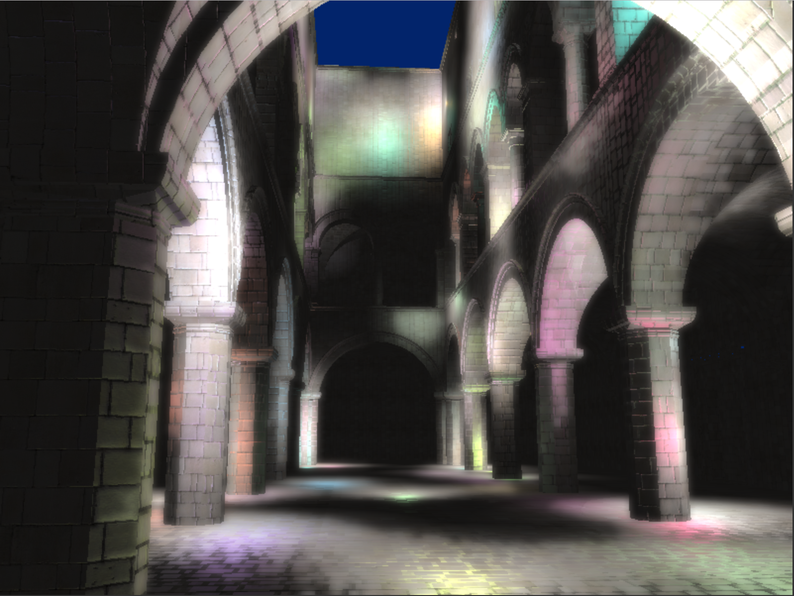

WebGL Deferred Shading
======================

**University of Pennsylvania, CIS 565: GPU Programming and Architecture, Project 5**

* Ethan Brooks
* Tested on: Google Chrome Version 54.0.2840.71 (64-bit)
  OS X Sierra, Intel Iris Pro 1536 MB

### Live Online

### Demo Video/GIF
[]

### Summary
For this project I implemented part of a deferred in WebGL. A deferred shader is a way to optimize shading in scenes with many lights. All geometries relevant to the fragment shading are calculated in a single pass and stored in a buffer (the g-buffer). Subsequently the fragment shader iterates through the lights in the scene and accesses the geometries in the buffer to color fragments lit by the light. In this project, I implemented the fragment shader, using the Blinn-Phong shading method, and two additional feature: toon shading and motion blur. I also made some additional adjustments to the scissor frame to ensure more accurate scissor clipping.

## Fragment shader
This shader uses the Blinn-Phong method. The brightness of an object is proportional to the angle between the surface normal and another angle, calculated as the sum of the vector from surface to eye and from surface to light.

## Toon shading
Toon shading discretizes light shading by bucketing shade levels into discrete buckets. In the simplest case -- two shade levels -- all cells lit above a certain threshold are shaded with the same amount of brightness and similarly for all cells lit below that threshold. My implementation of toon shading also uses an edge detector to outline edges. The edge detector applies a convolution over the depth associated with each pixel, picking out pixels adjacent to significant depth change and coloring these black.

[]

## Motion blur
Motion blur subsamples pixels over time in the direction of their velocity. In order to get the previous position of a pixel, I stored the screen-to-world transformation matrices for the previous turn. This transformation sends a point from screen space to world space. Using the previous turn's transformation matrix, I was able to calculate the points position in world space for the current and the previous turn and then calculate the difference between the two, yielding a velocity vector. I then subdivided this vector and subsampled pixels between the current and previous position. I noticed that the camera blur seemed to be a little jittery. In order to mitigate this, instead of storing a moving average of the previous frame's transformation matrix. This helped slightly, but I speculate that one flaw with this approach is that the inverse transformations from screen to world position tend to produce a lot of rounding errors. I suspect that a better looking, but less performant method would simply store the previous world position of each pixel from turn to turn. This would require storing a `vec4` for every pixel instead of simply storing a `mat4` as the current method does. That said, it might run faster since the blur mechanism would be spared some matrix inversions.

[]

## Scissor optimization
Since light attenuates with distance in our model, at a certain distance, light ceases to have any effect on an area. Consequently our shader only scans pixels within the light radius of any given light, establishing a rectangle around the edges of the circle cast by the light radius. The original implementation simply took the cube circumscribing the light sphere and rendered pixels lying between the upper left corner of this cube and the lower right. In a few edge cases, however, the resulting rectangle failed to fully enclose the light halo. To correct the error, I iterated through all eight corners of the circumscribing cube to calculate the actual minima and maxima along the x and y axes.

## G-buffer optimization
In order to optimize memory usage in the g-buffer, I pre-calculated surface normals, combining texture normals with surface normals before adding them to the g-buffer. The naive method stores texture normals and surface normals separately and combines them in the fragment shader. My optimization combines them first and stores the result in the g-buffer.

### Credits

* [Three.js](https://github.com/mrdoob/three.js) by [@mrdoob](https://github.com/mrdoob) and contributors
* [stats.js](https://github.com/mrdoob/stats.js) by [@mrdoob](https://github.com/mrdoob) and contributors
* [webgl-debug](https://github.com/KhronosGroup/WebGLDeveloperTools) by Khronos Group Inc.
* [glMatrix](https://github.com/toji/gl-matrix) by [@toji](https://github.com/toji) and contributors
* [minimal-gltf-loader](https://github.com/shrekshao/minimal-gltf-loader) by [@shrekshao](https://github.com/shrekshao)
