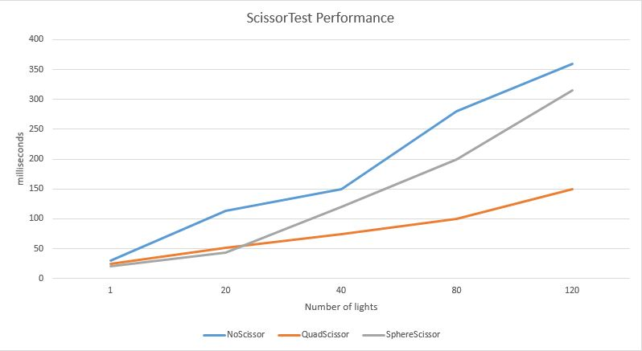

# University of Pennsylvania, CIS 565: GPU Programming and Architecture.
Project 5: WebGL Deferred Shading
===============

## User resources
- **Name:** David Grosman.
- **Tested on:** Microsoft Windows 7 Professional, i7-5600U @ 2.6GHz, 256GB, GeForce 840M (Personal laptop).

### Demo Video/GIF

[]

## Project description
This Project's purpose was to gain some experience with the basics of deferred shading and WebGL. I used GLSL and WebGL to implement a deferred shading pipeline and various lighting and visual effects.
In this project, I have implemented the following features:

* Implement deferred Blinn-Phong shading (diffuse + specular) for point lights
  * With normal mapping
* Implemented a Bloom Shader using post-process Gaussian blur.
* Scissor test optimization: I only accumulating shading from each point light source from a rectangle around the light.
* Optimized g-buffer format - reduced the number and size of g-buffers by:
  * Packing values together into vec4s
  * Using 2-component normals
  * Reducing the number of properties passed via g-buffer by applying the normal map in the `copy` shader pass instead of copying both geometry normals and normal maps.

### Running the code

If you have Python, you should be able to run `server.py` to start a server.
Then, open [`http://localhost:10565/`](http://localhost:10565/) in your browser.

This project requires a WebGL-capable web browser with support for
`WEBGL_draw_buffers`. You can check for support on
[WebGL Report](http://webglreport.com/).

Google Chrome seems to work best on all platforms. If you have problems running
the starter code, use Chrome or Chromium, and make sure you have updated your
browser and video drivers. Firefox's shader editor may require that you disable
WebGL debugging in `framework.js` (see below).

### Performance Analysis

From the graph above, we notice that:
  1. Scissoring is a very optimization feature and scales well as the number of lights in the scene increases.
  2. The Sphere scissoring is faster with fewer lights. This is mostly because while sphere proxies reduces the shaded area, they are overall more expensive to render than simple quads.

I have also noticed that applying the normal map in the `copy` shader pass instead of copying both geometry normals and normal maps is much faster (around 150% because of reduced memory bandwidth necessary to perform the operation). Using 2-component normals however is slower because of the mathematical operations necessary to compress the normal and to retrieve their Z component from their X and Y ones. 

### Credits

* [Three.js](https://github.com/mrdoob/three.js) by [@mrdoob](https://github.com/mrdoob) and contributors
* [stats.js](https://github.com/mrdoob/stats.js) by [@mrdoob](https://github.com/mrdoob) and contributors
* [webgl-debug](https://github.com/KhronosGroup/WebGLDeveloperTools) by Khronos Group Inc.
* [glMatrix](https://github.com/toji/gl-matrix) by [@toji](https://github.com/toji) and contributors
* [minimal-gltf-loader](https://github.com/shrekshao/minimal-gltf-loader) by [@shrekshao](https://github.com/shrekshao)
