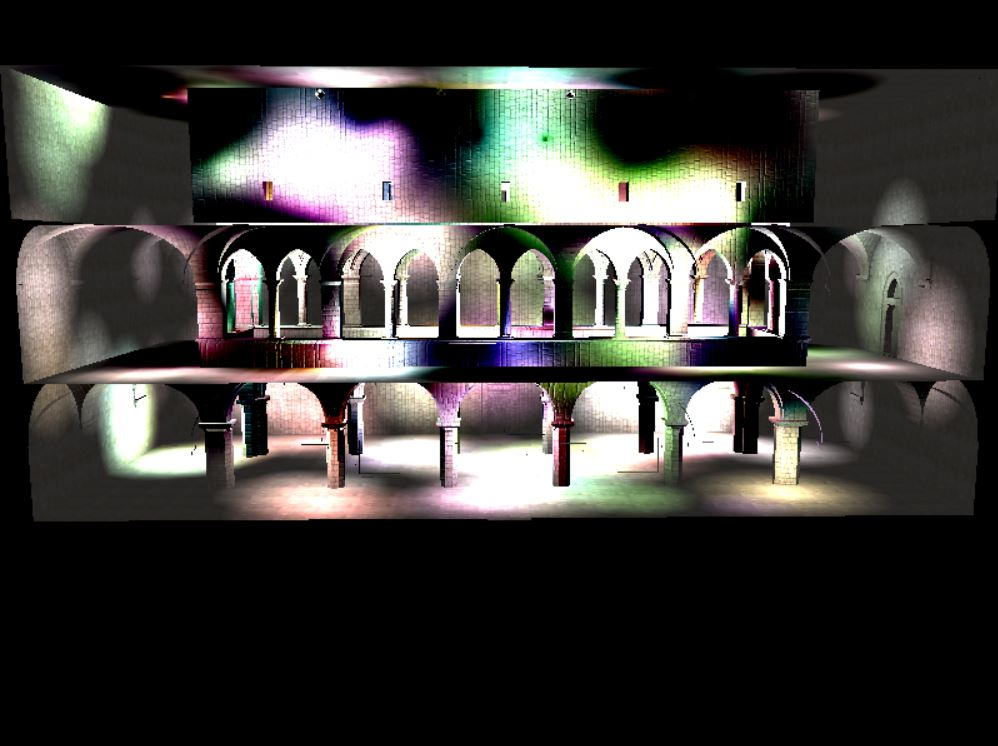
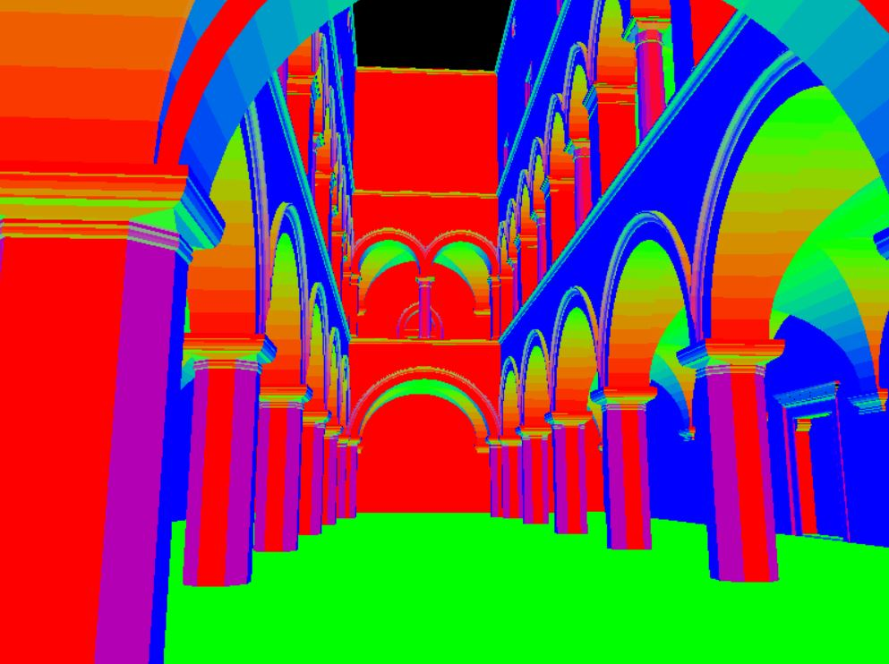

WebGL Deferred Shading
======================

**University of Pennsylvania, CIS 565: GPU Programming and Architecture, Project 4** 

* Xiang Deng
* Tested on:  Windows 10-Home, i7-6700U @ 2.6GHz 16GB, GTX 1060 6GB (Personal Computer)

### Live Online

For this project we used GLSL and WebGL to implement a deferred shading pipeline. Features include:

## Features

* Ambient light and Blinn-Phong light shading
* Scissor test
* Sphere model
* Bloom & Bloom plus
* G-buffer optimization 

### Demo Video/GIF

[ ] 

[ ] 

Here is the comparison between toon shading and lambert light:

With toon |  No toon 
:-------------------------:|:-------------------------:  
 |  

With toon |  No toon 
:-------------------------:|:-------------------------:  
 |  

Box bloom is also implemented; (just for fun) the right picture correspondings to 
alpha blending that is based on the blooming effect, I think it looks pretty cool when I zoom out and
visualize the whole building.

With Bloom |  With Bloom&lava
:-------------------------:|:-------------------------:  
 |  

This is everything..

[ ] 

Two models were used for light rendering, scissor and sphere, here is the visualization of the Two
in debug model

With Scissor Debug |  With Sphere Debug
:-------------------------:|:-------------------------:  
 |  

 
#debug images

Depth |  Position | Geometric normal
:-------------------------:|:-------------------------: |:-------------------------:  
 |  |  

Colormap |  Normalmap | Surface normal
:-------------------------:|:-------------------------: |:-------------------------:  
 |  |  

# Performance Analysis 

 

For differnt rendering effect, I am analyzing the change of performance based on the render time / total time ratio, which is 
extracted from Chrome profiling.  Here it shows 1. the sphere model consumes improves the costs by scissor test; 2. as number of 
lights increases, the the percentage of the time consumed by GPU rendering increases for all effects; for non-debug mode, adding shading effects
does not significantly increases the time; and apprarently rendering significantly increases the time than pure debugging visualization.
The spherical proxy renders the natural range of lights and saved wasted fragements by scissor squares, this helps with the improvement.
As number of lights increases, the GPU becomes more saturated and more dominant in the overll computation time percentage, this also suggests that optimization techniques
such as compaction might help improve the efficiency. 

 
 

For G-buffer optimization, since the normal, geometric normal and position buffers all have one free slot,
the three components was squeezed into the free slots and saves one buffer. Even though we only reduced the number of 
G-buffer from 4 to 3, we are still able to see the signifant improvments. (Here I am using FPS as measurements because the ms measure appears to be inacurrate.)
improvement by reducing G-buffer size by one also suggests we look at memory optimization, if time permits, will try Tiling for better improvments.

### Credits

* [Three.js](https://github.com/mrdoob/three.js) by [@mrdoob](https://github.com/mrdoob) and contributors
* [stats.js](https://github.com/mrdoob/stats.js) by [@mrdoob](https://github.com/mrdoob) and contributors
* [webgl-debug](https://github.com/KhronosGroup/WebGLDeveloperTools) by Khronos Group Inc.
* [glMatrix](https://github.com/toji/gl-matrix) by [@toji](https://github.com/toji) and contributors
* [minimal-gltf-loader](https://github.com/shrekshao/minimal-gltf-loader) by [@shrekshao](https://github.com/shrekshao)
