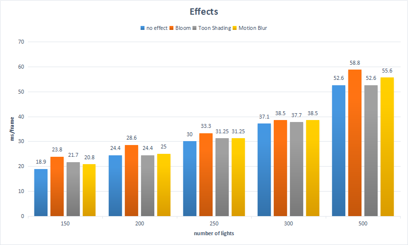

WebGL Deferred Shading
======================

**University of Pennsylvania, CIS 565: GPU Programming and Architecture, Project 5**

* Zimeng Yang
* Tested on: Windows 10, i7-4850 @ 2.3GHz 16GB, GT 750M (Personal Laptop)

### Demo Video/GIF

### Live Online

### Features
* [x] Effects 
  * [x] Blinn-Phong shading (diffuse + specular) for point lights
  * [x] Bloom using Gaussian blur, two-pass Gaussian blur separable convolution
  * [x] Toon shading 
  * [x] Screen-space motion blur
* [x] Optimizations
  * [x] Scissor test debug view
  * [x] Reduce number of g-buffer

### GUIs and Control

Features and optimizations can be toggled from GUIs as following:

* Debug
 * `debugView` select different g-buffers to render
* Scissor Test
 * `debugScissor` toggles scissor test rendering
 * `enableScissorTest` toggles scissor testing
* Bloom Effect
  * `enableBloom` toggles bloom effect
  * `bloomThreshold` changes threshold for blooming (lower means more blooming)
* Toon Shading Effect
 * `enableToon` toggles toon shading effect
 * `rampLevel` changes levels of ramp during toon shading 
 * `edgeThreshold` changes edge detection threshold (lowers means more edges)
* Motion Blur Effect
 * `enableMotionBlur` toggles motion blur effect
 * `motionBlurScale` changes motion blur scale (higher means more blurry)

#### Scissor Debug view

Scissor test can improve the performance, debug view for the scissor testing of each light source is implemented by a another pass using additive rendering (red quad) on the range of scissor test.

Screenshots for Scissor Debug View:

#### Blinn-phong shading 

Blinn-phong shading was implemented by ambient + specular + diffuse. Blinn-phong shading is the diffuse shading pass for all following screenshots.

#### Bloom Effect 

Two-pass Gaussian blur filter was applied to achieve bloom effect. First pass is along x-direction, and then second pass along y-direction. Ping-pong buffer is also applied for switching between x/y direction blurring. So two framebuffer objects are required during bloom pass. Two independent render textures are assigned to different framebuffer objects.

Screenshots for bloom effect:

|no effect| with bloom effect|
|------|------|
|||

with changing `bloomThreshold`.

#### Toon Shading Effect

Toon shading consists of two steps: ramp color value and edge detection.

Color ramping is achieved by stepping the color intensity with rampLevel parameters.
Edge detection is implemented using gradient detection of depth texture. Same as computer vision's edge detection method. At last, results from two steps were composited together to achieve a toon shading.

Screenshots for Toon Shading:

| small light number| big light number|
|------|------|
|||

with changing `rampLevel` and `edgeThreshold`.

#### Motion Blur Effect
 
Motion Blur is implemented by following the reference [Motion Blur](http://http.developer.nvidia.com/GPUGems3/gpugems3_ch27.html). Calculate the velocity and then sample along the velocity direction is the main idea.

Screenshots for Motion Blur:

with changing `motionBlurScale`.

### Performance Analysis

Performance analysis for two optimizations: scissor test and gbuffer number reduction; and four effects are concluded as following.

#### Scissor Test

Performance of scissor testing vs light numbers:

* scissor testing can improve performance significantly. Because for each light source, only partial texture range will be rendered instead of whole frame buffer. A lot of resources will be saved after scissor testing.

* with the increase of light source, scissor testing's performance or effect are more obvious.

#### G-buffer Reduction 

Performance of g-buffer numbers vs light numbers:

* reduction of usage of g-buffer can improve performance. The memory access in GPU is a very important aspect of performance.

* try to use less g-buffers and trying to access these buffers as less as possible can improve performance.

#### Effects

Performance of different effects vs light numbers:

* Bloom: the most expensive effect among the three. I think it's because of the many draw calls caused by two-pass Gaussian blurring. For each x or y direction blurring, I perform a 5 times blurring, so in total there are 10 draw calls over the whole frame buffer. It's very expensive.

* Toon Shading: this effect didn't change the overall performance very much. Since the operation during toon shading are only 1. ramp color and 2. edge detection. Ramp color can be easily achieved by vector computation. Edge detection is also implemented by vector computation and a threshold. It's a pretty cheap effect.

* Motion Blur: this effect involves motion velocity and sampling multiple pixels along velocity direction. An additional pass is needed. Computation is pretty cheap. But the motion blurring effect can improve the overall rendering looking / feeling very well. It's worth the cost to perform a motion blur. 

### Credits

* [Three.js](https://github.com/mrdoob/three.js) by [@mrdoob](https://github.com/mrdoob) and contributors
* [stats.js](https://github.com/mrdoob/stats.js) by [@mrdoob](https://github.com/mrdoob) and contributors
* [webgl-debug](https://github.com/KhronosGroup/WebGLDeveloperTools) by Khronos Group Inc.
* [glMatrix](https://github.com/toji/gl-matrix) by [@toji](https://github.com/toji) and contributors
* [minimal-gltf-loader](https://github.com/shrekshao/minimal-gltf-loader) by [@shrekshao](https://github.com/shrekshao)
