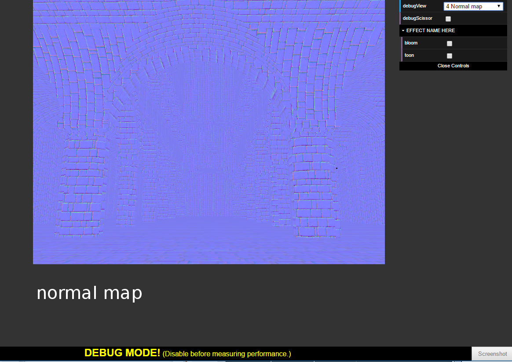
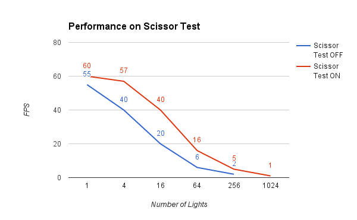

WebGL Deferred Shading
======================

**University of Pennsylvania, CIS 565: GPU Programming and Architecture, Project 5**

* Liang Peng
* Tested on: **54.0.2840.87 m (64-bit)** on
  Windows 10, i7-6700HQ @ 2.6GHz 8GB, GTX 960 (Personal Laptop)

[//]: # "### Live Online"

[//]: # ""

### Demo Video/GIF

### Features

* [x] Basic Pipeline
  * [x] Render to G-Buffer
  * [x] Deferred Shading
* [x] Scissor Test
  * [x] Scissor Mask Visualization
* [x] Post Effect
  * [x] Sky Color
  * [x] Bloom Effect
* [x] Performance Analysis

### Basic Pipeline

Depth | Position | Normal
--- | --- | ---
 |  | 

Color Map | Normal Map | Surface Normal
--- | --- | ---
 |  | 

Ambient Lighting | Blinn-Phong Lighting
--- | ---
 | 

Bloom OFF | Bloom ON
--- | ---
 | 

__Scissor Mask Visualization__

### Performance Analysis

#### Lighting

Ambient | Blinn-Phong | Ambient + Blinn-Phong
:---:|:---:|:---:
16 ms/frame | 60 ms/frame | 65 ms/frame

_*Note_ Ambient lighting is present due to infinite light bouncing in the space, which finally lights every object in the scene evenly (from all angle). Blinn-Phong light consists of, in the simpliest case, two types of lighting, lambert diffuse and specular. Diffuse reflectance is proportional to _dot product of surface normal and light direction_, while specular reflectance is proportional to _dot prodect of surface normal and halfway direction raised to power of shininess_, where halfway direction is the bisectional direction of light direction and view direction.

#### Number of Lights

Num | 1 | 4 | 16 | 64 | 256 | 1024
:---:|:---:|:---:|:---:|:---:|:---:|:---:
ms/frame | 20 | 25 | 50 | 190 | 640 | -
FPS | 55 | 40 | 20 | 6 | 2 | -
_Note*_ Data above are measured __without scissor test__.

Num | 1 | 4 | 16 | 64 | 256 | 1024
:---:|:---:|:---:|:---:|:---:|:---:|:---:
ms/frame | 19 | 24 | 28 | 60 | 200 | 800
FPS | 60 | 57 | 40 | 16 | 5 | 1
_Note*_ Data above are measured __with scissor test__.

#### Scissor Test

Scissor Test OFF | Scissor Test ON
:---:|:---:
 | 
_Note*_ Scissor box calculation is not accurate enough, thus results in noticeable artifacts.

_Note*_ With scissor test turned on, only pixels close enough to a particular light for which lighting will be computed, thus a considerable performance gain can be noticed in the figure.

#### Bloom

Bloom OFF | Bloom ON
:---:|:---:
36 ms/frame | 40 ms/frame

_*Note_ To achieve bloom effect, we first extract bright color from original color, then bleed the bright color of each pixel into its neighboring pixels, subject to a gaussian distribution. Commonly we will first do the color bleeding first in horizontal direction, then vertical direction. Finally we composite the blurred bright color and the original color to achieve bloom effect.

### Credits

* [Three.js](https://github.com/mrdoob/three.js) by [@mrdoob](https://github.com/mrdoob) and contributors
* [stats.js](https://github.com/mrdoob/stats.js) by [@mrdoob](https://github.com/mrdoob) and contributors
* [webgl-debug](https://github.com/KhronosGroup/WebGLDeveloperTools) by Khronos Group Inc.
* [glMatrix](https://github.com/toji/gl-matrix) by [@toji](https://github.com/toji) and contributors
* [minimal-gltf-loader](https://github.com/shrekshao/minimal-gltf-loader) by [@shrekshao](https://github.com/shrekshao)
