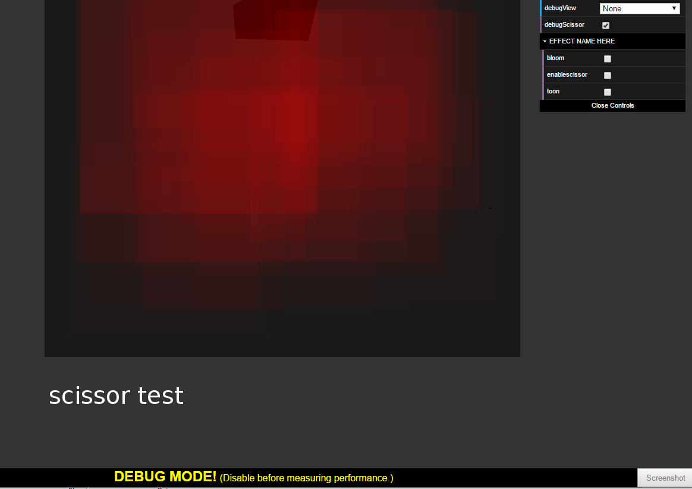

WebGL Deferred Shading
======================

**University of Pennsylvania, CIS 565: GPU Programming and Architecture, Project 5**

* Name: Zhan Xiong Chin
* Tested on: **Google Chrome (Version 54.0.2840.87 m (64-bit))** on
  Windows 7 Professional, i7-4700 @ 3.40GHz 3.40GHz 16GB, Quadro K600 1GB (SIG Lab)

### Live Online

### Demo GIF

### Features

* WebGL deferred Blinn-Phong shading
* Scissor test optimization
* G-buffer packing
* Bloom shader using gaussian blur with both 2d kernel and convolved 1d kernels
* Screen space motion blur

### Deferred shading introduction
A deferred shader packs information about each fragment to be rendered into g-buffers, then each light loops over the fragments rendered to screen to compute the final color of each pixel. This is an optimization over normal forward rendering, where lighting calculations will have to be done for each geometry fragment, even those which will not be rendered to screen due to the depth test. 

### Scissor test optimization
Each light only has a maximum radius that it would affect. Thus, a simple screen space AABB was used to cull away pixels outside of the maximum radius, to ensure that each light did not have to loop over every pixel in the screen when doing lighting computations. 

Scissor test bounding boxes

The bounding box computation is slightly inaccurate at the edges of screen space, causing unnatural-looking "edges" on lights near the edge of the screen. To remedy this problem, an option was added to scale the bounding boxes up, trading performance for a better visual effect. A further improvement that might be made beyond the current implementation is to use better AABB calculations, or to compute the scale factor according to how close to the center of the screen the bounding box is.

Adding the scissor test for lights improved performance significantly, enabling scenes with hundreds of lights to be rendered with little degradation to render times. The follow graphs show the performance of the scene for different numbers of lights (radius 4.0) and different sizes of bounding box vs no bounding box used.

### G-buffer packing
G-buffers are used to store fragment information that the material shaders subsequently use for lighting calculations. The basic "un-packed" data requires 4 g-buffers, storing the world space position, normals, texture color, and normal map direction for each fragment. To reduce the number of g-buffers needed and thus reduce the amount of memory that needs to be moved around to/from the GPU by the shaders, the following improvements were made, reducing the number of required g-buffers to two:

* The normal map was applied by the fragment shader, rather than by the lighting shader. This removed the need to include the normal map direction as part of a g-buffer.
* Only the x and y positions of the normals were stored, the final position can be calculated by z = sqrt(1 - x^2 - y^2). These two were stored into the first two components of the second g-buffer.
* The components of the color vector were converted from floating point values to 8-bit integers, then packed into the last two components of the second g-buffer.

While these optimizations did not make a noticeable difference for the standard 800x600 screen, since each individual g-buffer is not very big, with increased screen resolution and size, the packed g-buffers began to perform better (25 lights):

### Bloom shader
A bloom shader was used for light glow effects. In this, a filter is applied to detect bright parts of the image. Then, a gaussian blur (using a 5x5 kernel) was applied over these bright parts, and they are added back to the original image. This creates a light glow effect, as shown below.

</img>
</img>
</img>
</img>

From left to right: Original image, brightness filter, Gaussian blurred, Image with glow

This was further optimized by using two separate convolutions (horizontal and vertical) using a 1D Gaussian kernel, rather than using a 2D kernel. However, there was no observable difference in rendering time between the two. Also, the extra overhead of the Bloom shader only became apparent at 1600x1200 screen resolution, and even then it only slowed the rendering time from 40 to 45 ms. This suggests that the main performance bottleneck of the deferred renderer is not in the post-processing steps.

### Screen space motion blur

Screen space motion blur was achieved by copying the computed world space positions of the previous frame for each fragment, and projecting it using the current camera matrix instead. From these, we can obtain the new screen space position of the old fragment, and blur the rendered image between those two points. The debug view for motion vectors is shown below; the R and G values are determined by the X and Y difference between the previous position and current position in screen space.

Debug view for motion vectors, note the slight color changes indicating the motion vectors as the image moves

Motion blur

Motion blur causes a similar slowdown in performance as Bloom glow; it does not cause slowdown unless the screen resolution is high, as it is a post-processing step that is implemented in a similar fashion. 

### Credits

* [Three.js](https://github.com/mrdoob/three.js) by [@mrdoob](https://github.com/mrdoob) and contributors
* [stats.js](https://github.com/mrdoob/stats.js) by [@mrdoob](https://github.com/mrdoob) and contributors
* [webgl-debug](https://github.com/KhronosGroup/WebGLDeveloperTools) by Khronos Group Inc.
* [glMatrix](https://github.com/toji/gl-matrix) by [@toji](https://github.com/toji) and contributors
* [minimal-gltf-loader](https://github.com/shrekshao/minimal-gltf-loader) by [@shrekshao](https://github.com/shrekshao)
