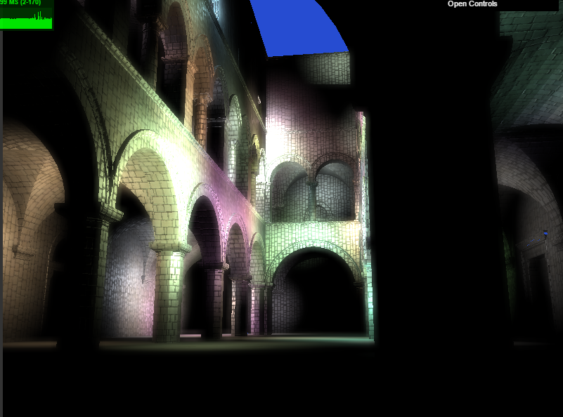
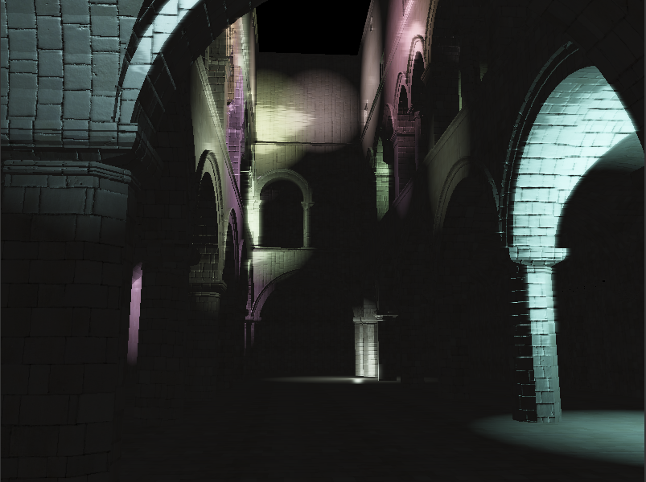
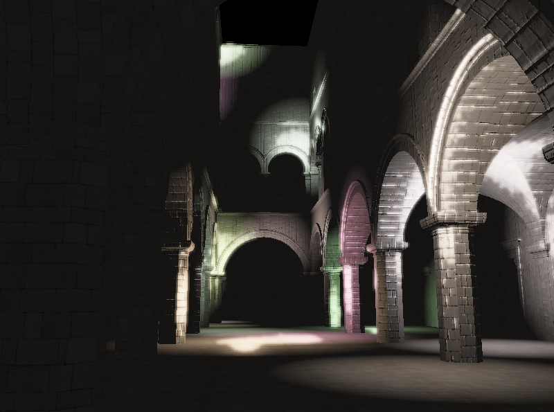

WebGL Deferred Shading
======================

**University of Pennsylvania, CIS 565: GPU Programming and Architecture, Project 5**

* Akshay Shah
* Tested on: **Google Chrome 54.0.2840.87 m** on Windows 10, i7-5700HQ @ 2.70GHz 16GB, GTX 970M 6GB (Personal Computer)

### Live Online

[](https://aksris.github.io/Project5-WebGL-Deferred-Shading-with-glTF/)

### Demo Video/GIF

[](https://vimeo.com/190890932)

### Deferred Renderer

Deferred shading is a screen-space method where the first pass does not actually involve shading and is deferred to the second pass. In the first pass positions, normals, and materials for each surface are rendered into the  g-buffer and the shading happens in the deferred pass computing the lighting at each pixel using textures. The primary advantage is that geometry is separate from lighting giving a significant performance improvement over raytracers or rasterizers.

&nbsp;&nbsp;&nbsp;&nbsp;This renderer uses several debug passes: Depth, position, normal and color map after packing the geometry normal into the copy stage.

| Depth | Position | Color Map | Blinn-Phong |
| ----- | -------- | --------- | ----------- |
|  |  |  |  |

This is the [sponza scene](http://graphics.cs.williams.edu/data/meshes.xml), with 20 lights (unless mentioned otherwise).
Optimizations include: gbuffer packing, improved screen-space aabb scissor test

| Without optimizations | With Optimizations |
| --------------------- | ------------------ |
| runs @ 40ms | runs @ 28ms |

Effects
-------

- [x] Implemented deferred Blinn-Phong shading (diffuse + specular) for point lights
  - With normal mapping
- [x] Bloom using post-process blur
  - [x] Two-pass Gaussian blur using separable convolution using a second postprocess render pass) to improve bloom or other 2D blur performance


There are also some undesired blurring artifacts visible.

This does not include the optimizations to the shading pass. With all the optimizations, the bloom runs at 34ms.

| Deferred pass | Bloom with 2-pass blur |
| ------------- | ---------------------- |
| runs @ 35ms | runs @ 40ms |

| Bloom without optimizations | Bloom with Optimizations |
| --------------------------- | ------------------------ |
| runs @ 40ms | runs @ 32ms |

  The bloom pass added 7.91% to the total computation which was only a ~4.8ms of the render time.

- [x] implemented efficient gaussian blur with linear sampling

| Bloom unoptimized | Bloom optimized with efficient linear sampling |
| ----------------- | ---------------------------------------------- |
| runs @ 40ms | runs @ 31ms |

There wasn't a very significant improvement in the performance as noted by [this][1] article.


No more artifacts.

[](https://vimeo.com/190890932)

Optimizations
-------------

- [x] Scissor test optimization: when accumulating shading from each point light source, only   render in a rectangle around the light.
  - [x] Improved screen-space AABB for scissor test

  

  The scissor test is an optimization that discards fragments that are out of the light's bounding box portion of the screen, thus improving the shading performance.

  > Polygons are clipped to the edge of projection space, but other draw operations like glClear() are not. So, you use glViewport() to determine the location and size of the screen space viewport region, but the rasterizer can still occasionally render pixels outside that region.

  Borrowed from [postgoodism](http://gamedev.stackexchange.com/users/19286/postgoodism) from [gamedev.stackexchange.com](http://gamedev.stackexchange.com/questions/40704/what-is-the-purpose-of-glscissor)

```javascript
 a.fromArray(l.pos);
a.w = 1;
a.applyMatrix4(view);
a.x -= l.rad;
a.y -= l.rad;
// a.z += l.rad;

// front bottom-left corner of sphere's bounding cube
b.fromArray(l.pos);
b.w = 1;
b.applyMatrix4(view);
b.x = a.x + l.rad * 2.0;
b.y = a.y + l.rad * 2.0;
b.z = a.z;
a.applyMatrix4(proj);
a.divideScalar(a.w);
b.applyMatrix4(proj);
b.divideScalar(b.w);
```

Here I'm not using `a.z`, but instead just reusing the variables to fill the `b` array. This neat little trick can improve the performance by a healthy 5~7ms.

- [x] Optimized g-buffer format - reduced the number and size of g-buffers:
  - Reduce number of properties passed via g-buffer, by:
    - Applying the normal map in the copy shader pass instead of copying both geometry normals and normal maps

So instead of using 4 GBUFFERS, I pack the normal in the copy pass as the geometry normal was only being used to calculate the surface normals which was what I needed all along.

So in the copy fragment shader:

```glsl
#version 100
#extension GL_EXT_draw_buffers: enable
precision highp float;
precision highp int;

uniform sampler2D u_colmap;
uniform sampler2D u_normap;

varying vec3 v_position;
varying vec3 v_normal;
varying vec2 v_uv;

vec3 applyNormalMap(vec3 geomnor, vec3 normap) {
    normap = normap * 2.0 - 1.0;
    vec3 up = normalize(vec3(0.001, 1, 0.001));
    vec3 surftan = normalize(cross(geomnor, up));
    vec3 surfbinor = cross(geomnor, surftan);

    return normap.y * surftan + normap.x * surfbinor + normap.z * geomnor;
}
void main() {

    gl_FragData[0] = vec4( v_position, 1.0 );
    gl_FragData[1] = vec4(applyNormalMap(v_normal, texture2D(u_normap, v_uv).rgb), 1.0);
    gl_FragData[2] = texture2D(u_colmap, v_uv).rgba;

}

```

| With 4 GBuffers | With 3 GBuffers |
| --------------- | --------------- |
| runs @ 40ms | runs @ 36ms |

I figured most of the time spent calculating normals in the deferred pass is now being done in the copy pass and more registers on the GPU are freed up.

More stuff
-----------

- [x] Toon shading (ramp shader + simple edge detection)


Simple edge detection with ramp shader


- [x] Improved screen-space AABB for scissor test
- [x] Two-pass Gaussian blur using separable convolution (using a second postprocess render pass) to improve bloom or other 2D blur performance
- [x] Implemented a sobel edge filter


GPU tracing on Chrome
---------------------

Trying to make heads and tails of the gpu tracing in chrome.


### References

* [Three.js](https://github.com/mrdoob/three.js) by [@mrdoob](https://github.com/mrdoob) and contributors
* [stats.js](https://github.com/mrdoob/stats.js) by [@mrdoob](https://github.com/mrdoob) and contributors
* [webgl-debug](https://github.com/KhronosGroup/WebGLDeveloperTools) by Khronos Group Inc.
* [glMatrix](https://github.com/toji/gl-matrix) by [@toji](https://github.com/toji) and contributors
* [minimal-gltf-loader](https://github.com/shrekshao/minimal-gltf-loader) by [@shrekshao](https://github.com/shrekshao)
* [Toon shader](http://in2gpu.com/2014/06/23/toon-shading-effect-and-simple-contour-detection/) by Sergiu Craitoiu
* [Silhouette Extraction](http://prideout.net/blog/?p=54) by Philip Rideout
* [Bloom effect](http://learnopengl.com/#!Advanced-Lighting/Bloom) by Joey de Vries
* [Sobel and Frei-Chen edge detector](http://rastergrid.com/blog/2011/01/frei-chen-edge-detector/) by Daniel Rákos
[1]: http://rastergrid.com/blog/2010/09/efficient-gaussian-blur-with-linear-sampling/ "Efficient Gaussian blur with linear sampling"
