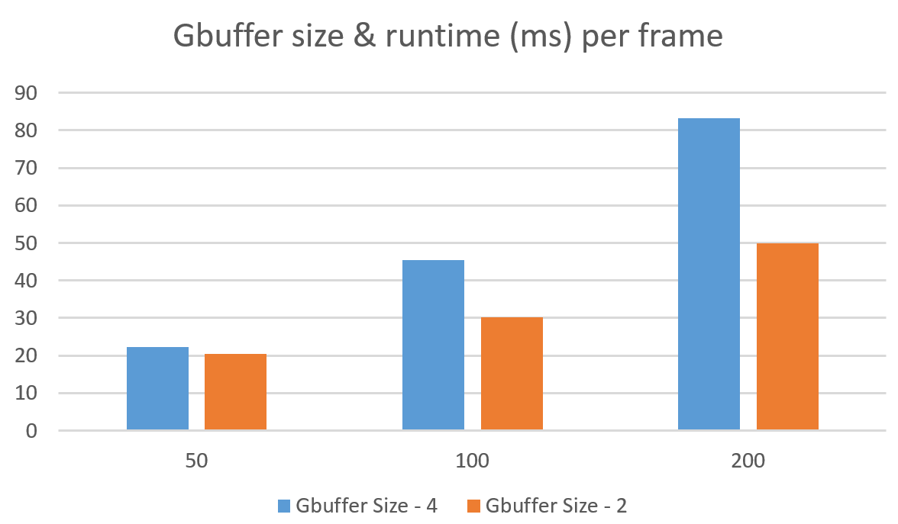

WebGL Deferred Shading
======================

**University of Pennsylvania, CIS 565: GPU Programming and Architecture, Project 5**

* Ruoyu Fan
* Tested on: **Google Chrome 54.0.2840.87** on
  * Windows 10 x64, i7-4720HQ @ 2.60GHz, 16GB Memory, GTX 970M 3072MB (personal laptop)

__NOTE:__ my submission requires an additional WebGL extension - `EXT_frag_depth`, used in `defered/ambient.frag.glsl` to properly write depth data into lighting passes' frame buffer to do __inverted depth test__ with __front-face culling__

### Live Online

[](https://windydarian.github.io/Project5-WebGL-Deferred-Shading-with-glTF/)

FIXME: glTF files returns 404 on GitHub Pages

### Demo Video/GIF

[](TODO)

### Work Done

* Deferred __Blinn-Phong shading__ with normal mapping
  * Using `clamp(1.0 - light_distance * light_distance / (u_lightRad * u_lightRad), 0.0, 1.0) ` as attenuation model for point lights
* __Bloom__ post-processing effect with __two-pass Gaussian blur__ using three steps:
  * First extract bright areas with a threshold
  * Then do a __two-pass Gaussian blur__ using separable convolution (vertical then horizontal)
    * Use menu option to control blur size (which changes uniform variable `u_scale` passing to `bloom.frag.glsl`)
  * Finally combine the blurred image to the original output
* __Scissor test for lighting__: when accumulating shading from each point light source, only render in a rectangle around the light.
  * Use `debugScissor` option to toggle scissor visual, or select `6 Light scissors` to show scissor only.
  * This is used to compare with my __light proxy__ implementation
* __Light proxy__: instead of rendering a scissored full-screen quad for every light, I render __proxy geometry__ which covers the part of the screen affected by a light (using spheres for point lights), thus __reducing wasted fragments in lighting pass__.
  * Using __inverted depth test__ with __front-face culling__ to avoid lighting geometries that are far behind the light, thus further reducing wasted fragments
  * This feature requires WebGL's `EXT_frag_depth` extension to write depth data into frame buffer at defered shading stage in order to do the depth test
  * Use `useLightProxy` option to toggle on/off and use `useInvertedDepthTestForLightProxy` option to toggle depth test and front face culling for lighting pass
* __Optimized g-buffer__ from 4*vec4 to 2*vec4 by compressing normal to two floats, increasing framerate to __167%__, see below for details

### Optimizing G-Buffer

The initial g-buffer implementation was 4*vec4 (4 textures), using each one for world position, geometry normal, color map and normal map. But in fact position and color can be stored in vec3, and we can use the information that __the length of a normal is one__ to __compress normal to 2 floats__.

So I optimized my g-buffer by using 2*vec4 (2 textures) and stored world position, color map, and world normal (applying normal map to geometry normal) into it.

The g-buffer before optimization was like:

|          | x         | y         | z         | w       |
|----------|-----------|-----------|-----------|---------|
| gbuffer0 | pos.x     | pox.y     | pox.z     | nothing |
| gbuffer1 | geomnor.x | geomnor.y | geomnor.z | nothing |
| gbuffer2 | color.r   | color.g   | color.b   | nothing |
| gbuffer3 | normap.x  | normap.y  | normap.z  | nothing |


__After my optimization__, the g-buffer is like:

| 0        | x                     | y                     | z                     | w               |
|----------|-----------------------|-----------------------|-----------------------|-----------------|
| gbuffer0 | pos.x                 | pox.y                 | pox.z                 | 2_comp_normal.x |
| gbuffer1 | color.r & normal sign | color.g & normal axis | color.b & normal axis | 2_comp_normal.y |

A typical way to do a 2-component normal is `normal.xy/normal.z` (and restore by `normalize(normal.x, normal.y, 1.0)`), but if `normal.z` is too small, there will be drastic precision loss for normals in that direction; and we cannot tell if the normal is inverted. So, I used some information from "color map" to "help" the normal.

What is `normal sign` and `normal axis`? Well, they are just a sign (+/-). Since colors in glsl are unsigned information stored in signed float, I made use of the sign of the floats to store some information about the normal by using a black magic.

Here is how I compress the normal

```
// BLACK MAGIC: use color map signs to represent which axis is seen as 1 in normal map
vec2 two_comp_normal;
if (abs(normal.z) > 0.33)
{
    two_comp_normal = normal.xy/normal.z;
    colmap.z *= -1.0;
    colmap.x *= sign(normal.z); // and use x to store if normal is inverted
}
else if (abs(normal.y) > 0.33)
{
    two_comp_normal = normal.xz/normal.y;
    colmap.y *= -1.0;
    colmap.x *= sign(normal.y);
}
else
{
    two_comp_normal = normal.yz/normal.x;
    colmap.x *= sign(normal.x);
}
```

And here is how I restore the normal:

```
vec3 extractNormal(float nor_x, float nor_y, vec3 colmap)
{
    // Black magic: I colmap sign to prevent normal losing too much precision on a particular axis
    if (colmap.z < 0.0)
    {
        return normalize(vec3(nor_x, nor_y, 1.0)) * sign(colmap.x);
    }
    else if(colmap.y < 0.0)
    {
        return normalize(vec3(nor_x, 1.0, nor_y)) * sign(colmap.x);
    }
    else
    {
        return normalize(vec3(1.0, nor_x, nor_y)) * sign(colmap.x);
    }
}
```

Using the sign information as aid, I can store and restore World-space normal in two floats without much precision loss.

And here is the comparison for them

| Number of Lights | Gbuffer Size - 4 | Gbuffer Size - 2 |
|------------------|------------------|------------------|
| 50               | 22.2             | 20.4             |
| 100              | 45.5             | 30.3             |
| 200              | 83.3             | 50               |



We can see drastic performance boost here. But this is not a completely correct comparison - I migrated the combination of geometry normal and normal map from lighting stage to copy-to-g-buffer stage. So part of the performance bonus may come from not combining normals for every light.


### Credits

* [Three.js](https://github.com/mrdoob/three.js) by [@mrdoob](https://github.com/mrdoob) and contributors
* [stats.js](https://github.com/mrdoob/stats.js) by [@mrdoob](https://github.com/mrdoob) and contributors
* [webgl-debug](https://github.com/KhronosGroup/WebGLDeveloperTools) by Khronos Group Inc.
* [glMatrix](https://github.com/toji/gl-matrix) by [@toji](https://github.com/toji) and contributors
* [minimal-gltf-loader](https://github.com/shrekshao/minimal-gltf-loader) by [@shrekshao](https://github.com/shrekshao)
