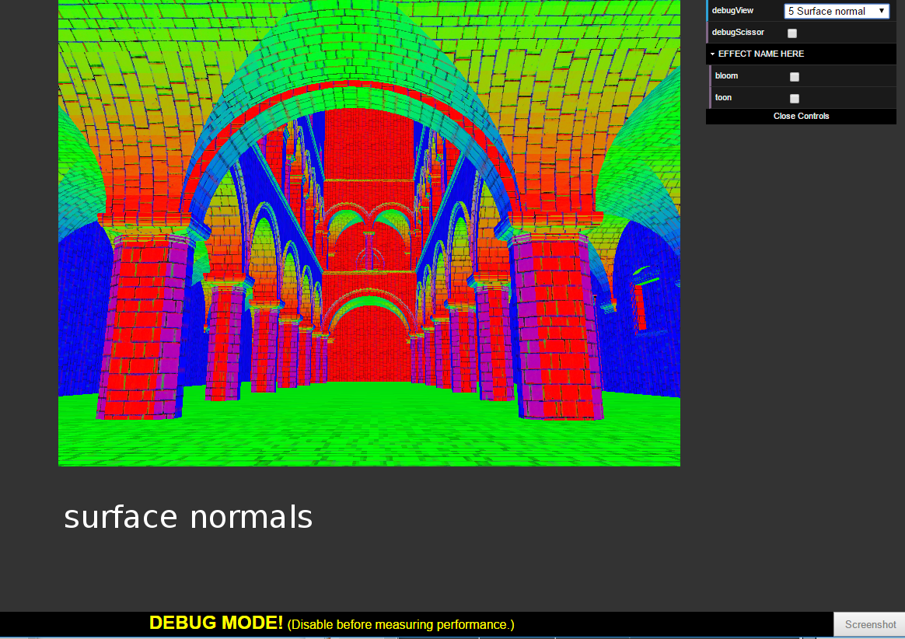

WebGL Deferred Shading
======================

**University of Pennsylvania, CIS 565: GPU Programming and Architecture, Project 5**

* Liang Peng
* Tested on: **54.0.2840.87 m (64-bit)** on
  Windows 10, i7-6700HQ @ 2.6GHz 8GB, GTX 960 (Personal Laptop)

### Live Online

### Demo Video/GIF

### Features

* [ ] Basic Pipeline
  * [x] Render to G-Buffer
  * [ ] Deferred Shading
* [ ] Post Effect
* [ ] Performance Analysis

### Basic Pipeline

Depth | Position | Normal
--- | --- | ---
 |  | 

Color Map | Normal Map | Surface Normal
--- | --- | ---
 |  | 

Ambient Lighting | Blinn-Phong Lighting
--- | ---
 | 

### Credits

* [Three.js](https://github.com/mrdoob/three.js) by [@mrdoob](https://github.com/mrdoob) and contributors
* [stats.js](https://github.com/mrdoob/stats.js) by [@mrdoob](https://github.com/mrdoob) and contributors
* [webgl-debug](https://github.com/KhronosGroup/WebGLDeveloperTools) by Khronos Group Inc.
* [glMatrix](https://github.com/toji/gl-matrix) by [@toji](https://github.com/toji) and contributors
* [minimal-gltf-loader](https://github.com/shrekshao/minimal-gltf-loader) by [@shrekshao](https://github.com/shrekshao)
