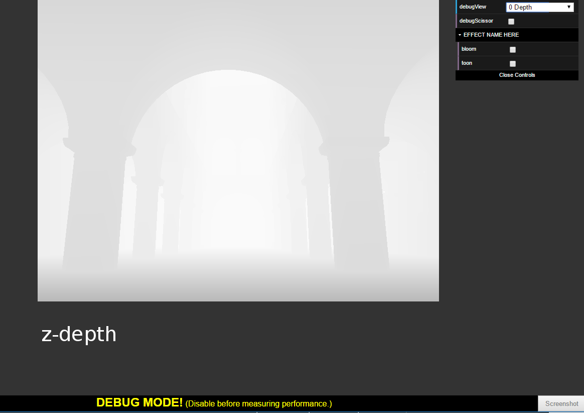
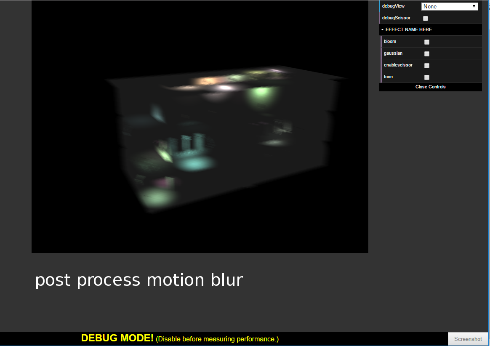

WebGL Deferred Shading
======================

**University of Pennsylvania, CIS 565: GPU Programming and Architecture, Project 5**

* (TODO) Rony Edde
* Tested on: **Google Chrome 222.2** on
  Windows 10, i7-6700k @ 4.00GHz 64GB, GTX 980M 8GB (Personal Laptop)

### Live Online
[Live Demo](http://www.3dde.com/webgl/Project5-WebGL-Deferred-Shading-with-glTF/index.html)

### Demo Video/GIF

### Description
This is a WebGL deferred renderer.
  * Passes are rendered to the frame buffer, then composited in a deferred shader.
  The deferred shaders shade and light the resulting fragments by their attributes.
  Normals, normal maps, positions, texture and depth are precomputed and the deferred
  pass computes the lighting and shading of the final image.
  
  * Pass layout.
    * Z-depth.
      * This is the depth pass that computes the distance to camera.  This is useful
      for multiple post effects such as depth of field.
      
    * Position.
      * This is a position pass where every fragment stores the xyz positions of the rendered geometry.
      
    * Geometry Normal
      * This is a pass for the geometric normals coming straight from the mesh geometry
      
    * Color Map
      * This is the texture and color of the geometry again with no shading.  Only the texture color is applied.
      
    * Normal Map
      * This is similar to the texture pass but it contains the normal map texture for compting fake surface detail shading.
      
    * Surface Normal
      * This is a final calculation of the geometric normal with the normal map applied to it.
      
    
  * Final result with all passes combined
    * After combining all the layers and computing the blinn-phong lighting model, here's the final result:  
      
      
  * Final result with a toon shader
    * Using the blinn-phong shader, we can extend it by computing the dot product of the surface normal and camera and accentuate the shading.  There are 3 color intensities chosen.  Black for perpendicular vectors, half color for facing geometry with less than 0.5 value and full color for less than 0.25.
       

  * Post processing
    * Bloom:  
      By blurring the final rendered image and compositing it on top with a gl blend function, we can add a bloom post process effect.
      There are 2 modes in the bloom shader implemented.  Square blur which is the default and gaussian blur which is computed for every       pixel. 
      Here's the result:  
      
      
    * Motion blur  
      By sampling the camera motion and computing the difference transformation matrix, we can gereate motion vectors and use them to  generate blur in that direction.  Shader version 100 doesn't support matrix operations so we're forced to compute the difference beforehand which is not a bad idea since the shader will have to do less work over an unvarying variable, however the THREE.js precision isn't as good as expected so we get a few artifacts when the camera is slowing down to a complete stop.  Still the results are not too bad:  
      
      
     
     * Optimizations:
       Enabling scissor tests dramatically improves performance.  Rendering only the square that the fragments overlap the sphere radius.  
       The initial mode with scissor test is shown here: 
       
       
       We can even go further by rendering a sphere as an instance for the scissor test:  
       
       
       
  * Performance analysis with scissor tests:  
    * Running the scissor test on 20 lights has almost no impact on performance.  It's only when increase the number of lights to about 100 and more that we truly see the benefit of the scissor test.  Here are the results:  
      
    
    We can clearly see an improvement inperformance.  The time per frame is halved.  This is particularly noticeable when using gaussian bloom since the gaussian computation is heavy.
    
    
    THANK YOU
    
    
    
    
### Credits

* [Three.js](https://github.com/mrdoob/three.js) by [@mrdoob](https://github.com/mrdoob) and contributors
* [stats.js](https://github.com/mrdoob/stats.js) by [@mrdoob](https://github.com/mrdoob) and contributors
* [webgl-debug](https://github.com/KhronosGroup/WebGLDeveloperTools) by Khronos Group Inc.
* [glMatrix](https://github.com/toji/gl-matrix) by [@toji](https://github.com/toji) and contributors
* [minimal-gltf-loader](https://github.com/shrekshao/minimal-gltf-loader) by [@shrekshao](https://github.com/shrekshao)
