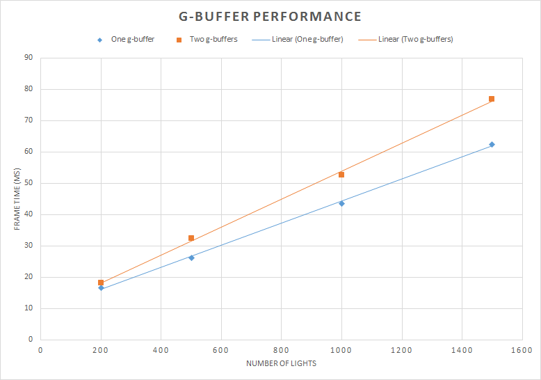
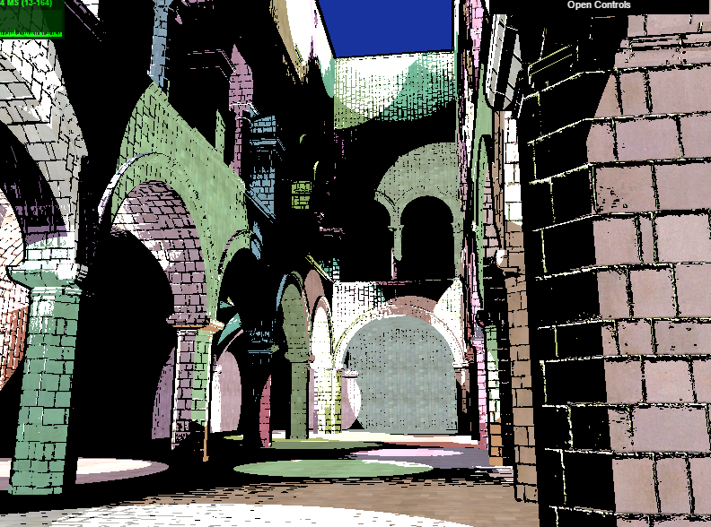

WebGL Deferred Shading
======================

**University of Pennsylvania, CIS 565: GPU Programming and Architecture, Project 5**

* Ottavio Hartman
* Tested on: **Google Chrome 54.0.2840.71**
  Windows 10, FX-8320 @ 3.50GHz 8GB, GTX 1060 3GB

### Live Online

### Demo GIF

[Additional Video](https://youtu.be/Ue2dwt0cAYE)

### Basic Deferred Renderer

This is a WebGL implementation of a deferred renderer. Some of the features I have included are Blinn-Phong shading, toon shading, and motion blur. The optimizations
which make the renderer run smoothly include scissor rendering and reducing the number of g-buffers needed to render the scene. 

The deferred renderer first renders the scene to 4 different textures, known as g-buffers. These textures hold the color, position, normal, and normal-map information
for every fragment on the screen. By sampling these textures in a shader in a per-light loop, I use their information to implement Blinn-Phong shading very rapidly for
hundreds of lights.

Below is an image from the renderer calculating the shading from 400 lights.

Because the algorithm loops over the number of lights in the scene, it gets slower as more lights are added. The graph below shows how the render time increases 
linearly in proportion to the number of lights added to the scene. That is, as the number of lights doubles, the render time also roughly doubles.

#### glScissor

An easy and efficient optimization I implemented is using gl.scissor to define a bounding box in which each light's shader should be rasterized. Instead of rendering
the entire screen quad for each light, a screen-space bounding box is calculated and WebGL renders the light within that bounding box. The performance improvement
can be seen below:

Clearly, this is a large performance boost with a fairly simple implementation. In its best case, this can reduce the render time of a large number of small lights greatly.
In its worst case, it simply renders the full-screen quad for each light, if the lights' radii are very large. Below is the debug view of the scissor boxes:

#### G-Buffer optimization

Another optimization I added is reducing the number of g-buffers from 4 to 3. I did this by removing the `w` value from position, geometry normal, and color, which freed up 3 bytes
in which to fit the normal information from the normal map. Because of this, the data is 'packed' among the three buffers and some information is spread between the buffers. This is
basically a "free" optimization because no (necessary) information is lost and the look-up time of each value is essentially the same. The performance benefit can be seen below:

This clearly helps a lot since a large array of floats is no longer passed as a uniform to the lighting shaders. This optimization scales with the number of pixels because the 
buffer size is equal to the number of pixels and the lighting calculations remain the same.

### Toon Shading

Toon shading was added as a seperate shader. It does two things: clamps the lighting equations to a step function and renders black borders around objects in the scene.
The lighting equation is straightforward, basically rounding the lambert value of each light to a value nearby. The black borders are rendered not in the vertex shader,
which is how cel shading is usually done, but in the fragment shader. Each pixel samples its own depth from the depth buffer and then samples its neighbors to the left
and right. Depending on the difference in depth value, the pixel may render itself as black in order to outline the edge of objects.

This works OK in this scene, however it is not truly cel shading. This is because it does not distinguish between objects and edges, but rather differences in depth values
among pixels. The base of the columns in the image below, for example, are not cel shaded properly because the shading is done in a fragment shader. The upside of this
is that the calculation scales with the screen size and not with the number of vertices on screen. Therefore, this approach would be well-suited for applications which
have a very large number of objects and vertics in the scene but need quick cel shading.

The performance analysis of the toon shader proved to be underwhelming: every result was within 1% of the normal blinn-phong shader in terms of render time. This is because
the toon shader is doing roughly the same number of lighting calculations. In addition, the black outline only adds two depth look-ups per pixel, which is easily within 1ms
of render time. 

### Bloom

The renderer includes a naive bloom implementation. I use the word "naive" because it samples from `d*d` pixels, where `d` is the width of the blur. This post-process effect
was implemented by first passing lighting information along to the post-process shader. This was acheived by using the alpha channel of the color g-buffer to tell which parts
of the image are brighter than other parts. Next, the shader simply loops over all of a pixel's neighbors and calculates the average color, using the alpha channel as a multiplier 
of the color. The effect can be seen below:

Notice how the light bleeds into the dark areas of the image:

The bloom filter can be combined with the toon shader:

The bloom post-process effect is interesting because it scales with the number of pixels and the size of the blur used in the shader. In fact, its render time is completely independent from
the number of lights in the scene. The graph below is the same graph for rendering with and without the bloom effect. That is, the 16x16 filter adds <1ms of time to each frame. The spike at 
1600 lights is not due to the bloom filter but rather the blinn-phong shading.

An optimization I could have added to the bloom filter is seperable convolution, which would turn the shader from `d*d` time to `d` time, while requiring a seperate buffer. The basic algorithm
is to first calculate the pixel averages on one axis and store them in the buffer. Then, calculate the pixel color averages from the buffer on the other axis. This would only show performance
improvement if using a bloom filter of size bigger than 16x16 (at least on my computer). 32x32 took an average of `16ms` to render while 64x64 took `51ms`. 

### Motion Blur

The motion blur implementation was adapted from http://http.developer.nvidia.com/GPUGems3/gpugems3_ch27.html.

Motion blur was added as a post-process effect. Similarly to bloom, its runtime degrades with number of pixels and not with number of lights/geometry. The basic algorithm is to use the position
vector of the piece of geometry the fragment shader and translate it back into screen-space using the view-projection matrix of the __previous frame__. Then, the pixel coordinate is subtracted from
the old pixel coordinate to get a velocity. Below is a still image of the velocity as the camera spins around the scene.

This velocity is then used to sample texels in the color texture in that direction. In other words, the shader samples nearby texels in the direction of the velocity and averages them. This creates
a screen-space blurring effect.

Like bloom, this effect has <1ms render time per frame and therefore does not reduce the render time noticeably.

### Credits

* [Three.js](https://github.com/mrdoob/three.js) by [@mrdoob](https://github.com/mrdoob) and contributors
* [stats.js](https://github.com/mrdoob/stats.js) by [@mrdoob](https://github.com/mrdoob) and contributors
* [webgl-debug](https://github.com/KhronosGroup/WebGLDeveloperTools) by Khronos Group Inc.
* [glMatrix](https://github.com/toji/gl-matrix) by [@toji](https://github.com/toji) and contributors
* [minimal-gltf-loader](https://github.com/shrekshao/minimal-gltf-loader) by [@shrekshao](https://github.com/shrekshao)
* [Blur implementation](http://http.developer.nvidia.com/GPUGems3/gpugems3_ch27.html)
