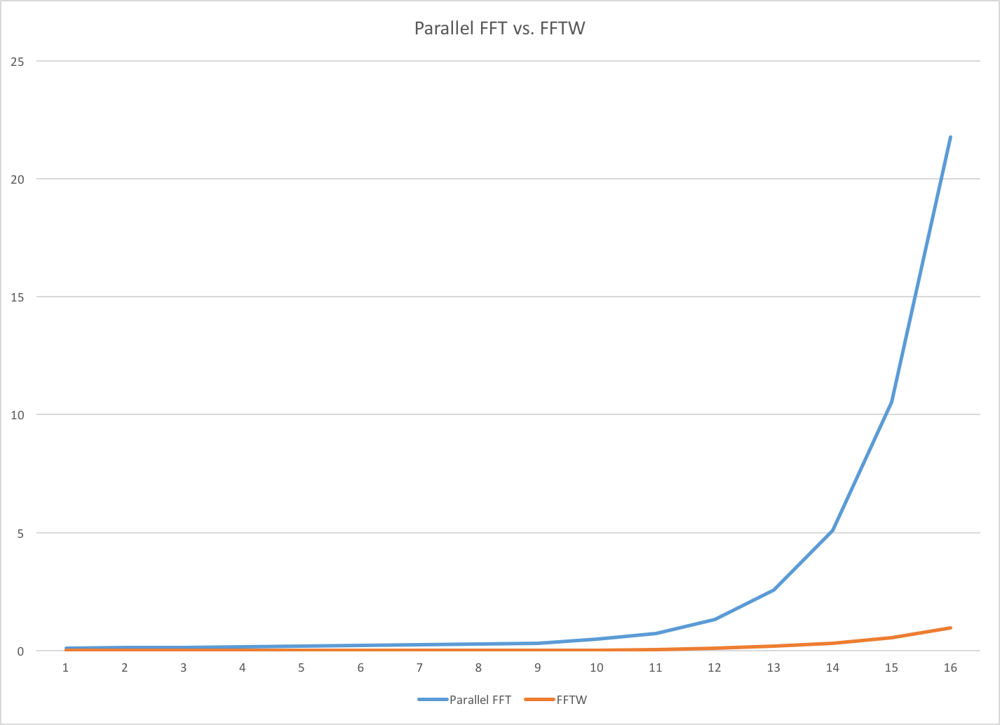

Parallel Fast Fourier Transform
======================

**University of Pennsylvania, CIS 565: GPU Programming and Architecture, Project 5**

* Gabriel Naghi
* Tested on: 
 - CPU implementation: Linux OpenSUSE, Intel Xeon E5-2470 @ 2.4 GHz, 32 GB RAM (Eniac)
 - GPU Implementation: Windows 10, Intel Core i7-2600 @ 3.4 GHz, 8 GB RAM, GeForce GT 730 1024 MB (DSL)

##Fourier Transforms
Fourier Transforms define a process by which to trasnform a signal from the time domain to the frequency ("forward transform") and vice versa ("inverse transform"). Fourier Transforms rely on the principle that any signal can be represented as magnitude and phase as a function of frequency.  

Source: Wikipedia

Representing a signal in the freqency domain is useful for a few reasons. First and foremost, it tells you what frequencies are present in the signal, and in what proportions. Another important use is that a multiplication in frequency domain is equivalent to a convolution in the time domain. It is generally easier to transform and multiply than compute a convolution. A similar optimization exists with regard to cross-correlations. It is also much easier to compute the n-th derivative of a function in the frequency domain than in the time domain. There are many other uses of Fourier Transforms (see discussion [here](http://dsp.stackexchange.com/questions/69/why-is-the-fourier-transform-so-important)).

##Discrete Fourier Transforms

In practice, Discrete Fourier Transforms (DFT) are used. This means that samples are of finite quantity and are equally spaced over time. The transform occurs by correlating each sample with with analyzing functions in the form of sinusoids. Of course, this produces high coefficients when the sample is similar and low amplitudes when dissimilar. 

In general the formula for computing a given frequency bucket in a DFT is as follows: 

Source: http://www.cmlab.csie.ntu.edu.tw/cml/dsp/training/coding/transform/fft.html

This results in an O(N^2) algorithm. We can do much better.

##Fast Fourier Transforms
Originally discovered by Carl Friedrich Gauss, and re-popularized by J.W. Cooley and John Tukey in the 20th century, the Fast Fourier Transform exploits two properties to reduce the number of elemetary operations:

Source: http://www.cmlab.csie.ntu.edu.tw/cml/dsp/training/coding/transform/fft.html

In short, this allows us to recursively break up DFTs into N/2 point problems in a divide-and-conquer strategy, and recombine the sub-pieces. 

From Wikipedia, the Cooley Tukey FFT pseduocode is as follows:

~~~
X0,...,N−1 ← ditfft2(x, N, s):      DFT of (x0, xs, x2s, ..., x(N-1)s):
    if N = 1 then
        X0 ← x0                     trivial size-1 DFT base case
    else
        X0,...,N/2−1 ← ditfft2(x, N/2, 2s)        DFT of (x0, x2s, x4s, ...)
        XN/2,...,N−1 ← ditfft2(x+s, N/2, 2s)      DFT of (xs, xs+2s, xs+4s, ...)
        for k = 0 to N/2−1                        combine DFTs of two halves into full DFT:
            t ← Xk
            Xk ← t + exp(−2πi k/N) Xk+N/2
            Xk+N/2 ← t − exp(−2πi k/N) Xk+N/2
        endfor
    endif
~~~

###Parallel Fast Fourier Transform Algorithm

My parallel implementation of the fast fourier transform was divided into three primary stages:

1. Input reorganization
2. Twiddle factor multiplication
3. Butterfly

The first stage simply consists of reorganizing the inputs to such an order that the outputs will be in their respective correct buckets. As it happens, the output order is just the reverse-bit order of the inputs. Bit reversal is a harder problem than one might initially realize, but fortunately Stanford hosts a page about just this (see [here](http://graphics.stanford.edu/~seander/bithacks.html)). I used the "Reverse an N bit quantity in parallel n 5 * lg(N) operations" method. 

After the inputs have been reorganized, the sub-DFTs must be computed. Starting at the base case of N=2, the upper half indices are multiplied by their proper twiddle factor. Then the N values add or subract with the element N/2 away. This forms the famous "butterfly" patten, depicted below in an image from Wikipedia. 

These operations are conducted lgN times, each time involving O(N) complex additions/subtractions, as depicted in the flow diagram below.

Source: Scientific Research Publishing

The time complexity of this algorithm is thus O(NlgN). However, there is plenty of embarrassing parallelism, and thus a parallel implementation should really speed things up over a serial implementation. 

##Performance Analysis

My first optimization, as always was to find the generally optimal blocksize for the working implementation. No particular intermidiate value performed particulary well, so I chose blocksize of 64 as my "optimal" blocksize, against which I compared the CPU implementation. 

Unfortunately for me (and everyone else hoping for an easy exploit in the embarassingly parallel department) FFTW, an acronym for Fastest Fourier Transform in the West, really lives up to its name. It completely blew away my parallel GPU implementation, even on very large inputs.

To be fair to my unhappy little implementation, FFTW is a 100k + line monstrosity of finely tuned computation, and is generally considered the gold standard when it comes to fourier transforms. Some of the optimizations imbued in FFTW are:

* Routines coded in Assembly
* SIMD Instructions
* Dynamic Programming techniques to select from multiple strategies for a given input and machine (including memory and cache)
* Hard Coded Unrolled FFTs for small sizes

##Future Work
There is a lot of room for improvement in the FFT implementation I've done. Among these are:

* Vectorization
* Shared Memory usage
* Generalization to non radix-2 

##Bloopers

I spent a gratuitous amount of time trying to decode GPU Gems 2's description of the algorithm, especially with regard to the Twiddle factor.

Source: NVIDIA GPU Gems 2

I could not figure out for the life of me what the relationship was between the stage/index and the exponent of the presumably global Nth root of unity. Fortunately, I eventually stumbled upon this graph, which depicts the proper proceedure and generally makes sense vis a vis the actual Cooley Tukey algorithm.

Source: Scientific Research Publishing

###Sources
* GPU GEMS 2
* [YouTube](https://www.youtube.com/watch?v=EsJGuI7e_ZQ)
