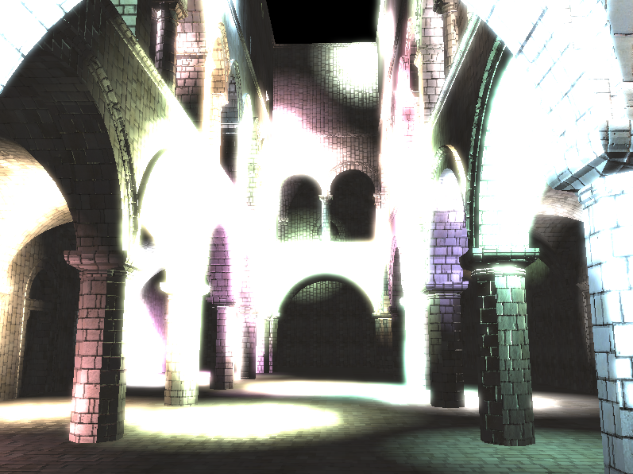

WebGL Deferred Shading
======================

**University of Pennsylvania, CIS 565: GPU Programming and Architecture, Project 5**

* Richard Lee
* Tested on: Windows 7, i7-3720QM @ 2.60GHz 8GB, GT 650M 4GB (Personal Computer)

## Features

* Basic Deferred Shading Pipeline with Lambert and Blinn-Phong shading
* Lighting Scissor Test Optimization
* Toon Shading
* Compact Normal Buffer Optimization
* Screen-Space Motion Blur
* Variable Material Properties

#### Basic Pipeline

This deferred shading renderer implements a deferred shader which lights a scene based on geometry buffers calculated in an initial pass. It uses the Lambert and Blinn-Phong reflection models with point lights to calculate the lighting for each light in the scene.

#### Toon Shading

An alternate toon shading view was added, which clamped the lighting at fixed intervals to give a cartoon look. This effect had a negligible effect on performance, as it only consisted of a few additional lines in the deferred shading stage.

#### Scissor Test

The scissor test optimization calculates the screen space bounding box and creates a scissor for each light before performing the lighting calculations, which is very effective because the majority of lights only take up a small portion of the scene when rendered. As seen when observing the average time per frame with and without the scissor test, the scissor test provided a substantial improvement in performance as the number of lights increased, and also decreased in performance at a slower rate than without the optimization.

When using the Firefox JavaScript profiler, the timing results did not take into account the WebGL draw calls, and only looked at the runtime on the CPU. This showed the scissor test as taking much longer than without the optimization, which was due to the fact that the screen space bounding box calculations were being performed for each light on each frame.

In addition, there was a visual difference when enabling the optimization, as lights that were behind the camera did not register a bounding box on the screen, even if they had initially cast light past the camera.

#### G-Buffer Optimization

The number of g-buffers was reduced by packing the geometry and texture normals into a single buffer. This was done by only storing the x and y components for the normals, as the z component could be recalculated from these components when performing the shading calculations. Performance wise, there was not much difference in the time taken per render call on the CPU, as seen in the chart above - the time per frame also remained about the same with and without the optimization. However, since we were able to remove the use of an entire buffer, this optimization would definitely be effective in terms of memory usage.

One caveat was that the recalculated normals seemed to have more contrast than without the optimization, giving a slightly different look to the model. This could be due to numerical precision issues, or a problem with the normal recalculation.

#### Motion Blur

Screen-space motion blur was also implemented as a post-process shader, by calculating how far each visible point on the screen had moved relative to the camera using the camera matrix stored from the previous frame and the position g-buffer. This gave a screen-space velocity for each point, which was then used to interpolate the result from the deferred shading pass. This post-process did not have a noticeable effect on performance of the renderer.

#### Material Properties

Additional variability in materials was included with the addition of a specular exponent value in the g-buffers, which allowed for multiple objects with different amounts of reflectivity to be rendered at the same time.

### Credits

* [Three.js](https://github.com/mrdoob/three.js) by [@mrdoob](https://github.com/mrdoob) and contributors
* [stats.js](https://github.com/mrdoob/stats.js) by [@mrdoob](https://github.com/mrdoob) and contributors
* [webgl-debug](https://github.com/KhronosGroup/WebGLDeveloperTools) by Khronos Group Inc.
* [glMatrix](https://github.com/toji/gl-matrix) by [@toji](https://github.com/toji) and contributors
* [minimal-gltf-loader](https://github.com/shrekshao/minimal-gltf-loader) by [@shrekshao](https://github.com/shrekshao)
